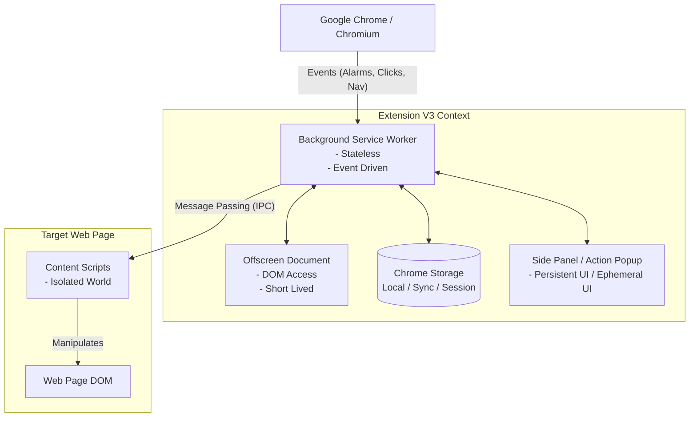
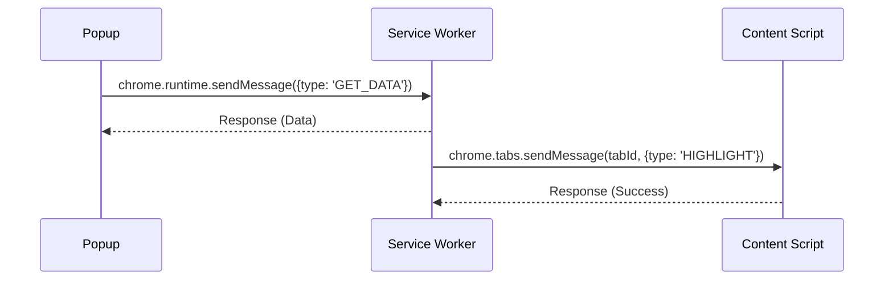

# Chrome Extensions (Manifest V3) Architecture & Inner Workings Deep Research

**Tarih:** 2026-09-30
**Protokol:** /deepwork, /product-deepsearch
**Kapsam:** Google Chrome Extensions MV3 (Manifest V3), Service Workers, Side Panel, Offscreen Documents, Güvenlik ve Depolama Mimarisi

---

## 1. Chrome Extensions MV3 Genel Mimarisi ve V2'den V3'e Geçiş Felsefesi

Google, Manifest V3 (MV3) ile Chrome eklenti ekosisteminde köklü bir paradigma değişikliğine gitmiş ve 2026 itibarıyla MV2'yi tamamen kullanımdan kaldırmıştır. MV3'ün temel motivasyonları şu üç ana sütun üzerine inşa edilmiştir:

1. **Güvenlik (Security):** Uzaktan barındırılan (remotely hosted) kodların çalıştırılmasının yasaklanması. Eklentiler sadece kendi paketlerinde (bundle) bulunan kodları çalıştırabilirler. CSP (Content Security Policy) sıkılaştırılmış, inline script'lere izin verilmemiştir.
2. **Performans (Performance):** Sürekli çalışan (persistent) `background pages` yerine, olay tabanlı (event-driven) ve geçici (ephemeral) olan **Service Worker** mimarisine geçiş. Bu sayede kullanılmayan eklentiler bellek veya işlemci tüketmez. Ağ isteklerinin engellenmesi veya değiştirilmesi işlemleri, Service Worker'da JS çalıştırmak yerine `declarativeNetRequest` API'sine devredilmiştir.
3. **Gizlilik (Privacy):** Kullanıcı verilerine erişimin azaltılması ve daha şeffaf bir izin modeli (least-privilege). Kullanıcılar artık eklentilere sadece belirli siteler için anlık erişim verebilir (`activeTab` ve runtime host permissions).

### Temel Sistem Görünümü



---

## 2. Çekirdek Bileşenler ve Yaşam Döngüsü

MV3 eklentileri, birbirleriyle Message Passing üzerinden haberleşen izole bileşenlerden oluşur.

### 2.1. Background Service Worker (SW)
Manifest V3'te eklentinin kalbi, arka planda çalışan Service Worker'dır.
- **Statelessness (Durumsuzluk):** SW sürekli çalışmaz. Olaylar (event) geldiğinde uyanır, işini yapar ve inaktif kaldıktan ~30-300 saniye sonra Chrome tarafından uyutulur (terminate). Bellek içi değişkenler (global variables) kalıcı değildir.
- **Uyanma (Wake-up) & Keep-Alive:** Tarayıcı olayları, alarmlar (`chrome.alarms`) veya IPC mesajları SW'yi uyandırır. Belirli işler (örneğin WebRTC) dışında SW'yi sürekli açık tutmaya çalışmak anti-paterndir.
- **API Erişimi:** Eklenti API'lerine (chrome.*) tam erişimi vardır ancak **DOM erişimi yoktur** (window, document nesneleri yok). Fetch API ile ağ istekleri yapılabilir.

```typescript
// background.ts (Service Worker)
chrome.runtime.onInstalled.addListener(() => {
    chrome.storage.local.set({ appState: 'initialized' });
});

chrome.alarms.create('fetchData', { periodInMinutes: 60 });

chrome.alarms.onAlarm.addListener((alarm) => {
    if (alarm.name === 'fetchData') {
        // Fetch operations
    }
});
```

### 2.2. Content Scripts
Web sayfalarının bağlamında çalışan JavaScript dosyalarıdır.
- **Isolated World:** Content script'ler, sayfanın kendi JavaScript'inden izole bir ortamda çalışır. Sayfanın değişkenlerine doğrudan erişemezler, ancak **DOM'u ortak paylaşırlar**.
- **Main World Injection:** Sayfanın JavaScript değişkenlerine erişmek gerekirse, script'ler `MAIN` dünyasına enjekte edilebilir (Chrome 111+ destekler).
- **Yaşam Döngüsü:** Sayfa yüklendiğinde (`document_start`, `document_end`, `document_idle`) çalışırlar ve sayfa yenilendiğinde yok olurlar.

```json
// manifest.json parçası
"content_scripts": [
  {
    "matches": ["https://*.google.com/*"],
    "js": ["content.js"],
    "css": ["styles.css"],
    "run_at": "document_end",
    "world": "ISOLATED"
  }
]
```

### 2.3. Action (Popup) ve Options Page
- **Action UI (Popup):** Tarayıcı araç çubuğundaki eklenti simgesine tıklandığında açılan geçici (ephemeral) HTML pencereleridir. Kullanıcı başka yere tıkladığında anında kapanır ve DOM'u yok edilir.
- **Options Page:** Kullanıcının eklenti ayarlarını yönettiği tam sayfa veya modal sayfalardır.

### 2.4. Side Panel API (Chrome 114+)
Geliştiricilere kalıcı, sekmeler arası bağlamı koruyan bir yan panel sunar. Not alma, asistan (AI/LLM) veya çeviri eklentileri için idealdir.
- Sekme değişse bile kapanmaz, kullanıcı kapatana kadar kalıcıdır.

```json
"side_panel": {
  "default_path": "sidepanel.html"
},
"permissions": ["sidePanel"]
```

### 2.5. Offscreen Documents API
Service Worker'ın DOM erişimi olmaması sorununu çözmek için tasarlanmıştır. Panoya kopyalama, Canvas üzerinden resim manipülasyonu, ses çalma (Audio) veya iframe tabanlı işlemler için gizli, kısa ömürlü (short-lived) bir pencere açar.

```typescript
// Background SW'den Offscreen document oluşturma
async function createOffscreen() {
  const existingContexts = await chrome.runtime.getContexts({
    contextTypes: ['OFFSCREEN_DOCUMENT']
  });
  if (existingContexts.length > 0) return; // Zaten var

  await chrome.offscreen.createDocument({
    url: 'offscreen.html',
    reasons: ['DOM_PARSER', 'AUDIO_PLAYBACK'],
    justification: 'Extracting data from raw HTML and playing notification sound'
  });
}
```

---

## 3. Süreçler Arası İletişim (IPC) Mimarisi

Bileşenler arası veri transferi Chrome'un Message Passing API'leri ile yapılır.

### 3.1. One-Time Requests
En yaygın iletişim yöntemidir. `chrome.runtime.sendMessage` (SW'ye) veya `chrome.tabs.sendMessage` (Content Script'e) kullanılır.



### 3.2. Uzun Ömürlü Bağlantılar (Port Tabanlı)
Sürekli bir veri akışı (stream) veya durum korumalı iletişim gerekiyorsa kullanılır.

```typescript
// İstemci (Content Script veya Popup)
const port = chrome.runtime.connect({name: "stream-channel"});
port.postMessage({status: "ready"});
port.onMessage.addListener((msg) => { console.log(msg); });

// Sunucu (Service Worker)
chrome.runtime.onConnect.addListener((port) => {
  if (port.name === "stream-channel") {
    port.onMessage.addListener((msg) => {
      port.postMessage({reply: "ack"});
    });
  }
});
```

### 3.3. Externally Connectable
Web sayfalarının (örn. sizin sahip olduğunuz bir SaaS paneli) doğrudan eklentiyle haberleşmesini sağlar.

```json
"externally_connectable": {
  "matches": ["https://app.myservice.com/*"]
}
```

---

## 4. Güvenlik ve İzolasyon Modeli

### 4.1. Content Security Policy (CSP)
MV3'te uzaktan barındırılan kod yasaktır. CSP, eklentinin manifest dosyasında katı bir şekilde tanımlanmıştır ve gevşetilemez.
`script-src 'self'; object-src 'self';` zorunludur. Dinamik olarak `<script src="https://cdn...">` eklenemez. Tüm bağımlılıklar pakete dahil edilmelidir.

### 4.2. declarativeNetRequest (DNR)
MV2'deki performans ve gizlilik sorunlarına neden olan `webRequestBlocking` API'si yerine gelmiştir. Eklenti, tarayıcıya filtreleme kuralları (regex, url bazlı) verir, ağ isteklerini tarayıcının çekirdek motoru (C++ katmanında) engeller veya değiştirir.

```json
// rules.json
[
  {
    "id": 1,
    "priority": 1,
    "action": { "type": "block" },
    "condition": {
      "urlFilter": "*://*.tracker.com/*",
      "resourceTypes": ["script", "xmlhttprequest"]
    }
  }
]
```

### 4.3. İzin Modeli (Permissions)
- **Host Permissions:** Belirli sitelere erişim hakkı. `*://*.google.com/*` gibi.
- **Active Tab:** Sadece kullanıcının eklentiye tıkladığı an (action), aktif olan sekme için geçici izin verir. En güvenli yoldur.
- **Optional Permissions:** Kullanıcıdan ancak özellik kullanılmak istendiğinde anlık izin istemek için kullanılır.

---

## 5. Durum ve Depolama Yönetimi

Service Worker'ların her an kapanabilmesi, durumu (state) hafızada tutmayı imkansız kılar. State yönetimi depolama API'leri ile yapılır.

| API | Özellik | Kullanım Senaryosu |
|---|---|---|
| `chrome.storage.local` | Cihaza özel kalıcı depolama. Limit 5MB (sınırsız yapılabilir). | Önbelleğe alma, büyük konfigürasyonlar. |
| `chrome.storage.sync` | Google hesabı üzerinden cihazlar arası senkronize olur. Kotası düşüktür (100KB). | Kullanıcı tercihleri, tema ayarları. |
| `chrome.storage.session` | Yalnızca tarayıcı oturumu süresince yaşar. Bellekte tutulur, diske yazılmaz. | Geçici session token'ları, hassas veriler. |

### IndexedDB Kullanımı
`chrome.storage` API'leri büyük boyutlu yapısal veriler (örneğin offline çalışan bir LLM eklentisi veritabanı) için yetersiz kalabilir. Bu durumda Service Worker, Offscreen veya Side Panel içinde yerleşik web standardı olan **IndexedDB** kullanılabilir. IndexedDB, Chrome tarafından eklentinin kendi origin'inde izole edilir.
