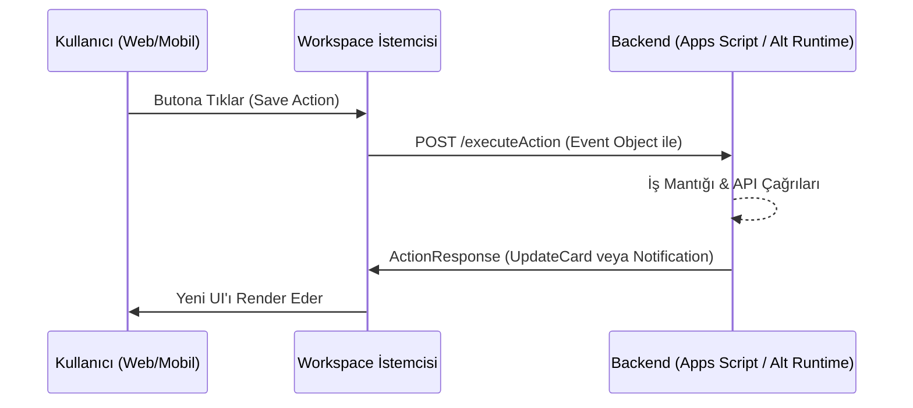

# Google Workspace Add-ons & Google Apps Script Mimari Analizi

**Tarih:** 30 Eylül 2026 (Simüle Edilen Standartlar)
**Protokol:** /deepwork, Clean Architecture
**Hedef Sistem:** Google Workspace Add-ons (GWAO), CardService, Alternate Runtimes

---

## 1. Google Workspace Add-ons Ekosistemi ve Felsefesi

Google Workspace Add-ons (GWAO), kullanıcının iş akışından (bağlamdan) ayrılmadan Workspace uygulamalarına entegre hizmetler sunmak için tasarlanmış genişletilebilirlik çerçevesidir. 

### Desteklenen Uygulamalar
GWAO şu anda geniş bir uygulama yelpazesini desteklemektedir:
- **İletişim & Takvim:** Gmail, Google Takvim, Google Meet.
- **İçerik & Dosya:** Google Drive, Google Dokümanlar, Google E-Tablolar, Google Slaytlar.

### Eski Editor Add-ons vs. Yeni Google Workspace Add-ons
Eskiden her doküman tipi (Docs, Sheets) için ayrı bir "Editor Add-on" yazılması ve HTML Service ile iframe tabanlı arayüzler geliştirilmesi gerekiyordu. 
Yeni nesil **Google Workspace Add-ons**, tek bir eklenti (tek bir proje ve manifest) ile tüm Workspace platformlarını kapsar. HTML/CSS yerine sunucu odaklı (server-driven) bildirimsel arayüzler (CardService) kullanılarak tutarlı bir UI sağlanır.

---

## 2. CardService Bildirime Dayalı (Server-Driven) UI Mimarisi

Workspace eklentileri arayüz oluşturmak için standart web teknolojileri yerine **CardService API** kullanır. Sunucu tarafında tanımlanan veri yapıları (veya Apps Script objeleri), istemcide yerel (native) arayüz bileşenlerine çevrilir.

### Hiyerarşik Yapı
- **Card:** Ana taşıyıcı (sayfa) bileşeni.
- **Section:** Kart içindeki görsel ve mantıksal ayırıcılar (bloklar).
- **Widget:** Etkileşimli veya görsel öğeler. (Örn: `TextParagraph`, `DecoratedText`, `TextInput`, `Button`, `SelectionInput`).

### Bildirime Dayalı UI'ın Avantajı
Bu mimari sayesinde geliştirici CSS veya HTML ile uğraşmaz. Yazılan Card JSON/Apps Script objesi;
- Web'de Gmail/Drive sağ yan panelinde,
- iOS ve Android Google Workspace uygulamalarında alt sayfa veya kart olarak **yerel (native) performansla** çalışır.

### Action ve Callback Mekanizması
Kullanıcı bir butona bastığında veya seçim yaptığında, istemci doğrudan JavaScript çalıştırmaz; bunun yerine sunucuya (backend'e) bir `Action` (callback) gönderir.

Sunucu iş mantığını çalıştırdıktan sonra bir `ActionResponse` döner:
- `Navigation`: `PushCard` (yeni kart ekle), `PopCard` (geri dön), `UpdateCard` (mevcut kartı yenile).
- `Notification`: Ekranda toast (uyarı) mesajı göster.



---

## 3. Tetikleyiciler (Triggers) ve Olay Yönelimli Model

Eklentiler yaşam döngüsü boyunca çeşitli Workspace olaylarına (events) tepki verir. Bu tepkiler eklenti manifestosunda (`appsscript.json`) tanımlanır.

### Unconditional Triggers (Bağlamsız)
- `homepageTrigger`: Kullanıcı bir eklentiye tıkladığında, bağlam (örn. açık bir e-posta) olmasa bile görünen ana giriş sayfasını (homepage card) oluşturur.

### Contextual Triggers (Bağlamsal)
- **Gmail:** `onGmailMessageOpen` (kullanıcı bir e-posta açtığında çalışır).
- **Drive:** `onDriveItemsSelected` (kullanıcı Drive'da bir veya birden fazla dosya seçtiğinde çalışır).
- **Calendar:** `onCalendarEventOpen` (bir etkinlik düzenleme ekranı açıldığında).

### Event Objects (Olay Bağlam Verisi)
Her tetikleyici, backend'e (Apps Script veya Alternate Runtime) zengin bir JSON nesnesi gönderir. Bu nesne kullanıcının dili (`userLocale`), zaman dilimi (`userTimezone`), seçilen dosya ID'leri veya açık e-postanın mesaj ID'si gibi bağlamsal bilgileri içerir.

---

## 4. Çalışma Zamanı Modelleri (Runtimes)

Google, Workspace eklentilerinin çalıştırılması için iki temel mimari sunar:

### 4.1. Google Apps Script V8 Runtime
Google'ın barındırdığı, JavaScript (ES6+ destekli V8 motoru) tabanlı sunucusuz ortamdır.
- **Dahili API'ler:** `SpreadsheetApp`, `GmailApp`, `CardService` gibi Workspace servislerine doğrudan, yetkilendirilmiş erişim sağlar.
- **Kullanım Senaryosu:** Hızlı geliştirme, basit entegrasyonlar, küçük ve orta ölçekli iç uygulamalar.

*Örnek Apps Script CardService Kodu:*
```typescript
function onGmailMessageOpen(e: GoogleAppsScript.Addons.EventObject) {
  const messageId = e.gmail.messageId;
  const accessToken = e.gmail.accessToken; // Geçici erişim token'ı
  
  const section = CardService.newCardSection()
    .addWidget(CardService.newDecoratedText()
      .setText(`Açılan Mesaj ID: ${messageId}`)
      .setIcon(CardService.Icon.EMAIL));
      
  const card = CardService.newCardBuilder()
    .setHeader(CardService.newCardHeader().setTitle("Bağlam Kartı"))
    .addSection(section)
    .build();
    
  return card;
}
```

### 4.2. Alternate Runtimes (HTTP / Cloud Functions vb.)
Geliştiricilerin Node.js, Python, Go, Java veya herhangi bir web framework'ünü (Cloud Run, AWS Lambda, şirket içi sunucular) kullanarak HTTPS webhook'ları üzerinden eklenti oluşturmasına olanak tanır.
- **Nasıl Çalışır:** Workspace, eklenti backend'ine standart bir JSON POST isteği atar, backend ise Google'ın belirttiği Card JSON formatında yanıt döner.
- **Avantajları:** 
  - Yüksek ölçeklenebilirlik ve performans optimizasyonu (CI/CD süreçlerine tam uyum).
  - Kurumsal ağlara (VPC, on-premise veritabanları) doğrudan bağlantı.
  - Şirkete ait özel kodun (proprietary code) Google sunucularında (Apps Script) barındırılmak yerine geliştiricinin kendi kontrolündeki ortamda çalışması.

*Örnek Alternate Runtime Yanıt Şeması (JSON):*
```json
{
  "action": {
    "navigations": [
      {
        "pushCard": {
          "header": { "title": "Hoş Geldiniz" },
          "sections": [
            {
              "widgets": [
                {
                  "textParagraph": { "text": "Bu harici bir Python backend'den geldi." }
                }
              ]
            }
          ]
        }
      }
    ]
  }
}
```

---

## 5. Güvenlik, Kimlik Doğrulama ve İzinler

### Google Cloud Platform (GCP) Proje Eşleştirmesi
Her Workspace eklentisi (Apps Script veya Alternate Runtime) zorunlu olarak standart bir GCP projesine bağlanmalıdır. Bu, API kotalarının takibini, faturalandırmayı ve OAuth rıza ekranı (OAuth Consent Screen) yapılandırmasını yönetmek için gereklidir.

### OAuth 2.0 Kapsamları (Scopes)
Eklentinin erişebileceği veriler manifest dosyasında (`oauthScopes`) tanımlanır.
- **Non-sensitive:** Profil bilgisi, eklentiyi yan panelde gösterme izni (ör. `https://www.googleapis.com/auth/workspace.link.create`).
- **Sensitive:** Drive dosya okuma, Gmail taslak oluşturma vb.
- **Restricted:** Tüm Gmail gelen kutusu okuma silme izni (Kapsamlı Google güvenlik denetimi gerektirir - CASA/Tier 2).

### Kimlik Doğrulama Stratejileri
- **Google OIDC ID Token:** Alternate Runtimes'da, gelen HTTPS POST isteklerinin gerçekten Google Workspace tarafından yapıldığını doğrulamak için Google'ın OIDC asimetrik anahtarları (`Google Verify Token`) kullanılır.
- **Access Tokens:** Eklenti tetiklendiğinde Workspace, event objesi içinde geçici bir `accessToken` gönderir. Bu token kullanılarak Google API'lerine eklenti kullanıcısı adına (delegate) çağrı yapılabilir.

### Manifest Yapılandırması (`appsscript.json`)
```json
{
  "timeZone": "Europe/Istanbul",
  "dependencies": { },
  "webapp": {
    "executeAs": "USER_ACCESSING",
    "access": "ANYONE"
  },
  "oauthScopes": [
    "https://www.googleapis.com/auth/gmail.addons.execute",
    "https://www.googleapis.com/auth/gmail.addons.current.message.readonly"
  ],
  "addOns": {
    "common": {
      "name": "Super Plugin",
      "logoUrl": "https://example.com/logo.png",
      "homepageTrigger": {
        "runFunction": "buildHomepage"
      }
    },
    "gmail": {
      "contextualTriggers": [
        {
          "unconditional": { },
          "onTriggerFunction": "onGmailMessageOpen"
        }
      ]
    }
  }
}
```

---

## 6. Özet ve Mimari Değerlendirme

Google Workspace Add-ons; HTML/CSS tabanlı, iframe bağımlı eski nesil eklentilerden uzaklaşarak, **"Bir Kere Yaz, Her Yerde Native Render Et" (Write Once, Render Native Anywhere)** felsefesine geçiş yapmıştır. Bildirimsel UI mantığı geliştirme esnekliğini sınırlasa da (özel JavaScript widget'larına izin vermez), Workspace platformlarında eşsiz bir tutarlılık, hız ve güvenlik sağlar. Alternate Runtimes seçeneği ise kurumsal ve ölçeklenebilir entegrasyonlar için mimari esnekliği en üst düzeye çıkarmıştır.
