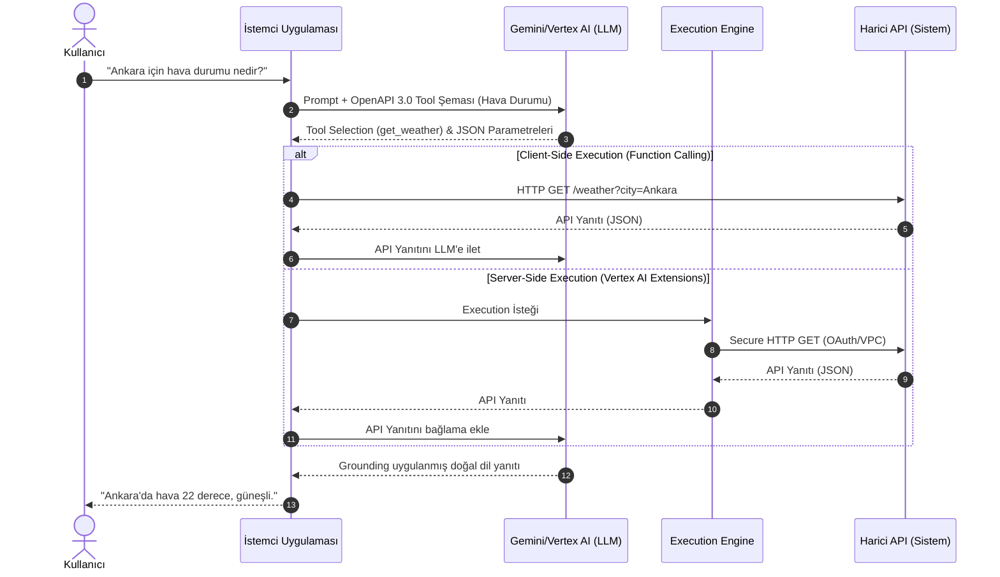

# Google Gemini & Vertex AI Extensions ve Eklenti Mimarisi (2025/2026 Standartları)

**Tarih:** 30 Eylül 2026
**Protokol:** `/deepwork`, Clean Architecture
**Konu:** Google Gemini & Vertex AI Extensions, Function Calling ve Model Context Protocol (MCP) Mimarisi

---

## 1. Yeni Nesil "Google Eklentisi": AI Dünyasında Plugin Paradigması

Google ekosisteminde "eklenti" kavramı, LLM'lerin harici sistemlerle konuşabilmesi üzerine yeniden tanımlanmıştır.

### Gemini Extensions (Kullanıcı Tarafı)
Kullanıcıların günlük hayatta kullandığı Google Workspace (Docs, Gmail, Drive), YouTube, Google Haritalar, Google Uçuşlar gibi servislerle doğrudan Gemini üzerinden etkileşime girmesini sağlar. Doğal dil komutlarını (örn. "Geçen haftaki proje dokümanımı özetle ve takvimime toplantı ekle") arka planda API çağrılarına çevirerek çalışır.

### Vertex AI Extensions / Agent Platform (Geliştirici ve Kurumsal Taraf)
Kurumsal çapta, LLM'leri şirket içi veritabanları, SaaS ürünleri veya özel API'lerle birleştirmek için kullanılır. 2025-2026 döneminde Vertex AI Extensions, yerini büyük oranda **Gemini Enterprise Agent Platform**'a bırakmıştır. Bu mimaride Extension'lar, Agent'ların kullanabileceği "Tool" (Araç) veya "Function" yapılarına entegre edilmiştir.

### Function Calling vs Extensions vs MCP
- **Function Calling:** Modelin, kendisine verilen JSON/OpenAPI şemalarına dayanarak yapılandırılmış parametre üretmesidir (Execution uygulama tarafındadır).
- **Extensions (Vertex AI / Agent Builder):** Sadece şema sağlamakla kalmaz, aynı zamanda Google Cloud altyapısı üzerinden API kimlik doğrulaması ve yürütmeyi de (Execution Engine) kapsayan tam yönetilen uçtan uca araçlardır.
- **MCP (Model Context Protocol):** LLM'ler ve veri kaynakları arasında standartlaştırılmış yeni nesil bir iletişim protokolüdür. Google mimarisinde MCP, aracıların (Agents) dış dünya ile standardize edilmiş bir arayüzle konuşmasına olanak tanıyarak spesifik uzantıların (extensions) oluşturulmasını kolaylaştırır.

---

## 2. Mimari ve Çalışma Mekanizması

Vertex AI ve Gemini ekosisteminde eklentiler, **OpenAPI 3.0** spesifikasyonunun LLM uyumlu bir alt kümesini kullanır. Bu sayede modelin anlayabileceği "Tool Schema" (Araç Şeması) LLM token bağlamına entegre edilir.

### İstek-Cevap Yaşam Döngüsü

1. **Kullanıcı Doğal Dil İstemi (User Prompt):** Kullanıcı, sisteme doğal dil ile bir istekte bulunur (örn: "Siparişim nerede?").
2. **Model Düşünme & Intent Sınıflandırma (Tool Selection):** Gemini, elindeki OpenAPI şemalarını tarar ve mevcut istemi çözmek için hangi araca (Tool) ihtiyacı olduğuna karar verir.
3. **Parametre Çıkarımı ve JSON Şema Doğrulaması:** Seçilen aracın beklediği girdiler (parametreler) model tarafından doğal dilden çıkarılır ve doğrulandıktan sonra yapılandırılmış JSON formatına dönüştürülür.
4. **Yürütme Motoru (Execution Engine):**
   - *Client-side (Function Calling):* Model sadece JSON döndürür, backend sistemi API'ye HTTP isteği atar.
   - *Server-side (Vertex AI Extensions):* Vertex AI, tanımlı kimlik bilgilerini (OAuth/Bearer vb.) kullanarak harici API'ye HTTP POST/GET isteğini doğrudan gerçekleştirir.
5. **Sonuç Entegrasyonu ve Grounding:** API'den dönen yanıt (örneğin JSON veri), tekrar LLM'in bağlamına beslenir. LLM bu veriyi yorumlayarak kullanıcıya nihai doğal dil cevabını üretir.

### Mimari Akış Diyagramı (Mermaid)



---

## 3. Güvenlik, Kurumsal Kimlik Doğrulama ve Ağ İzolasyonu

Kurumsal yapılarda dış API'lere erişim katı kurallara tabidir.
- **Kimlik Doğrulama:** Google Vertex AI Extensions; API Key, HTTP Bearer Token, Google OIDC (OpenID Connect) ve Service Account destekli OAuth 2.0 yapılarını destekler. Bu, modelin kullanıcı adına veya servis hesabı adına işlem yapmasına olanak tanır.
- **Kurumsal Ağ Güvenliği (VPC-SC & PSC):** Modelin, public internete açılmadan şirket içi (on-premise) veya VPC içerisindeki özel API'lere güvenli erişimi, **Private Service Connect (PSC)** ve **VPC Service Controls (VPC-SC)** ile sağlanır.
- **Hassas Veri Koruma:** Çıktıların ve girdilerin filtrelemesi, **Google Cloud DLP (Data Loss Prevention)** mekanizmaları ile sağlanarak Prompt Injection ve Veri Sızıntısına (Data Exfiltration) karşı savunma hattı oluşturulur.

---

## 4. Geliştirme ve Entegrasyon Süreci

### OpenAPI 3.0 Spesifikasyonu (Örnek Şema)

Gemini, OpenAPI'ın belirli bir alt kümesini kullanır:

```json
{
  "openapi": "3.0.0",
  "info": {
    "title": "Müşteri Sipariş API",
    "version": "1.0.0",
    "description": "Müşterinin sipariş durumunu sorgular."
  },
  "paths": {
    "/order-status": {
      "get": {
        "operationId": "getOrderStatus",
        "description": "Sipariş numarasına göre kargo durumunu döndürür.",
        "parameters": [
          {
            "name": "orderId",
            "in": "query",
            "description": "Alfanumerik sipariş numarası",
            "required": true,
            "schema": {
              "type": "string"
            }
          }
        ]
      }
    }
  }
}
```

### Vertex AI Extension Oluşturma (Python SDK)

```python
from google.cloud import aiplatform

aiplatform.init(project='my-enterprise-project', location='us-central1')

extension = aiplatform.Extension.create(
    display_name="Order Tracker Extension",
    description="Sipariş takip sistemine bağlanır.",
    manifest={
        "name": "order_tracker",
        "api_spec": {
            "open_api_yaml": "gs://my-bucket/openapi.yaml"
        },
        "auth": {
            "auth_type": "OAUTH",
            "oauth_config": {
                "service_account": "extension-sa@my-enterprise-project.iam.gserviceaccount.com"
            }
        }
    }
)
print(f"Extension created: {extension.resource_name}")
```

### Test ve Gözlemlenebilirlik
- **Cloud Logging:** Extension tarafından atılan HTTP çağrıları, response süreleri ve hatalar Cloud Logging üzerinde izlenir.
- **Token Maliyeti ve Latency:** Function calling kullanımı token maliyetini artırır. Gecikmeyi (latency) düşürmek için iç içe geçmeyen, optimize edilmiş JSON şemaları kullanılmalıdır.
