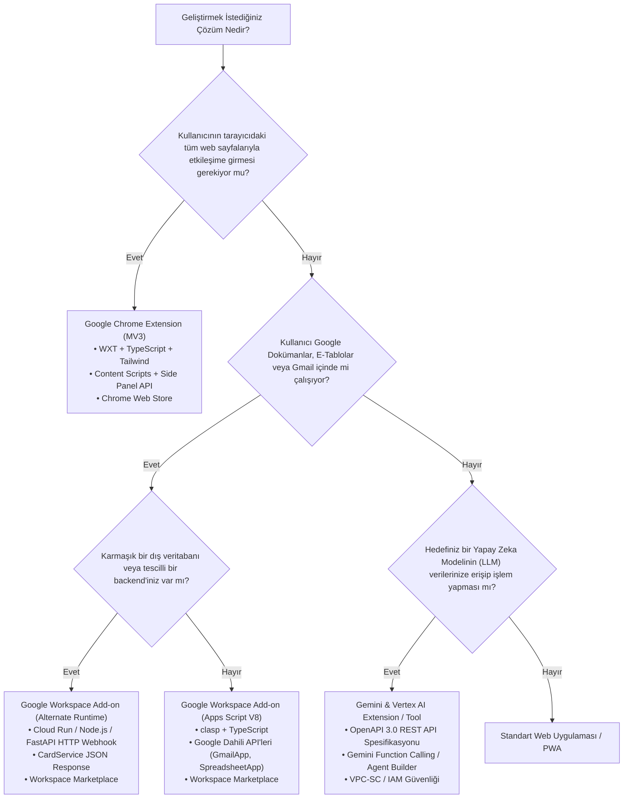

# Google Eklenti Ekosistemi: Kapsamlı Sentez, Karşılaştırma ve Karar Matrisi

**Tarih:** 30 Eylül 2026  
**Protokol:** `/deepwork` • `/product-deepsearch` • Clean Architecture • Enterprise Grade  
**Kapsam:** Chrome Extensions (MV3), Google Workspace Add-ons, Gemini & Vertex AI Extensions  

---

## 1. Yönetici Özeti ve Ekosistem Haritası

Google ekosisteminde "Plugin" (Eklenti) kavramı, tek tip bir mimariyi değil; kullanıcının etkileşimde bulunduğu arayüze, güvenlik sınırlarına ve platform hedeflerine göre özelleşmiş **3 ana bağımsız koldan** oluşan devasa bir ekosistemi ifade eder:

```
                                  ┌─────────────────────────────────────────────────────────────┐
                                  │               GOOGLE EKLENTİ (PLUGIN) EKOSİSTEMİ            │
                                  └──────────────────────────────┬──────────────────────────────┘
                                                                 │
         ┌───────────────────────────────────────┬───────────────┴───────────────┬───────────────────────────────────────┐
         ▼                                       ▼                               ▼                                       ▼
  [ SÜTUN 1: İSTEMCİ ]                   [ SÜTUN 2: OFİS ]               [ SÜTUN 3: VERİMLİLİK ]                 [ SÜTUN 4: YAPAY ZEKA ]
Google Chrome Extensions             Google Workspace Add-ons            Google Apps Script Automation          Gemini & Vertex AI Extensions
(Manifest V3 / Browser Level)        (Gmail, Drive, Docs, Sheets)        (Sheets Macro, Webhooks, Custom Func)  (Tool Calling, OpenAPI, Agents)
```

1. **Google Chrome Extensions (Manifest V3):** İstemci (Browser) tarafında çalışan, web sayfalarının DOM'unu manipüle edebilen, tarayıcı düzeyinde ağ filtreleme yapabilen ve yan panel (Side Panel) asistanları sunan eklentiler.
2. **Google Workspace Add-ons & Apps Script:** Google'ın bulut ofis yazılımları (Gmail, Docs, Sheets, Drive, Meet) içerisine gömülen, `CardService` ile bildirimsel (server-driven) çalışan veya `Alternate Runtimes` ile harici HTTP backend'lerle haberleşen kurumsal eklentiler.
3. **Google Gemini & Vertex AI Extensions:** Yeni nesil yapay zeka modellerinin (Gemini 1.5/2.0) harici dünya API'leri ile konuşmasını, veri tabanlarına sorgu atmasını ve eylem gerçekleştirmesini sağlayan OpenAPI 3.0 tabanlı akıllı eklentiler.

---

## 2. 3 Temel Google Eklenti Tipinin Karşılaştırma Matrisi

| Kriter | Chrome Extensions (Manifest V3) | Google Workspace Add-ons | Gemini & Vertex AI Extensions |
| :--- | :--- | :--- | :--- |
| **Ana Çalışma Alanı** | Google Chrome, Chromium tarayıcılar (Brave, Edge) | Gmail, Drive, Docs, Sheets, Calendar (Web & Mobil) | Gemini Web/App, Vertex AI Agent Builder, Özel LLM API |
| **Mimari Model** | İstemci Taraflı (Service Worker + Content Script + UI) | Sunucu Güdümlü (Server-Driven Declarative UI) | LLM Tool Calling / Function Calling Orchestrator |
| **Geliştirme Dilleri** | TypeScript, JavaScript, WebAssembly, HTML, CSS | TypeScript, JavaScript (V8), Python/Go/Node (Alternate) | OpenAPI (JSON/YAML), Python, Node.js, Go (API Backend) |
| **Önerilen Framework/Araç** | **WXT**, Vite + CRXJS, Playwright | **clasp**, CardService API, Node.js HTTP Service | Google AI Studio, Vertex AI SDK, FastAPI, MCP |
| **Arayüz (UI) Teknolojisi** | Shadow DOM + Tailwind, React/Vue/Svelte, Side Panel | CardService (Widgets: Text, Button, Dropdown) veya HTML | LLM Tarafından Üretilen Doğal Dil / Grounding Kartları |
| **Yaşam Döngüsü & State** | 30s inaktiflik sonrası uyuyan Service Worker + Storage | İstek-Cevap (Request-Response) döngüsü / Stateless | Tek oturumluk bağlam penceresi (Context Window) + Loglar |
| **Ağ Yetkileri (Networking)** | `declarativeNetRequest`, Fetch API, Host Permissions | `UrlFetchApp` (Apps Script) veya doğrudan Cloud Run | Vertex AI Execution Engine, Private Service Connect |
| **Güvenlik & İnceleme** | Katı CSP (Remote code yasak), Chrome Web Store Review | OAuth Consent Screen, CASA Tier 2/3 Güvenlik Denetimi | IAM, VPC-SC, Cloud DLP, Prompt Injection Koruması |
| **Yayın / Dağıtım Kanalı** | **Chrome Web Store** (veya kurumsal GPO policy) | **Google Workspace Marketplace** (Domain-Wide) | Vertex AI Extension Registry, Gemini Extensions Store |
| **Monetization (Gelir Modeli)** | ExtensionPay, Stripe Checkout, Freemium SaaS | Marketplace Ücretlendirmesi, Stripe, Kurumsal Lisanslama | API Token Tüketimi, Kurumsal SaaS B2B Kontratları |

---

## 3. Mimari Karar Ağacı: "Hangi Eklenti Türünü Geliştirmelisiniz?"



---

## 4. Araştırma Dokümantasyonu İndeksi

Bu araştırma serisi, Google eklentilerinin iç çalışma mekanizmalarını ve modern geliştirme pratiklerini derinlemesine ele alan 5 ana teknik rapordan oluşmaktadır:

### 1. [08_google_chrome_extensions_mv3_calisma_mimarisi.md](file:///Users/alperencnrr/Downloads/Masrafo/docs/codebase/researches/08_google_chrome_extensions_mv3_calisma_mimarisi.md)
- **Odak:** Chrome Manifest V3 çekirdek çalışma prensipleri.
- **Kritik Konular:** Background Service Worker yaşam döngüsü ve 30 saniyelik inaktiflik kuralı; Content Scripts ve "Isolated World" mantığı; Side Panel API; Offscreen Documents ile DOM/ses yetenekleri; Süreçler Arası İletişim (IPC) ve `declarativeNetRequest` ağ filtreleme mimarisi.

### 2. [09_google_chrome_extensions_modern_gelistirme_rehberi.md](file:///Users/alperencnrr/Downloads/Masrafo/docs/codebase/researches/09_google_chrome_extensions_modern_gelistirme_rehberi.md)
- **Odak:** 2026 standartlarında modern Chrome eklentisi geliştirme araçları.
- **Kritik Konular:** WXT (Vite tabanlı next-gen framework) vs Plasmo vs CRXJS; Shadow DOM ve TailwindCSS ile CSS izolasyonu; Playwright ile uçtan uca (E2E) eklenti testleri; GitHub Actions ile Chrome Web Store otomatik yayınlama (CI/CD) hattı; GA4 Measurement Protocol entegrasyonu.

### 3. [10_google_workspace_addons_apps_script_mimarisi.md](file:///Users/alperencnrr/Downloads/Masrafo/docs/codebase/researches/10_google_workspace_addons_apps_script_mimarisi.md)
- **Odak:** Google Workspace (Gmail, Drive, Docs, Sheets) eklenti mimarisi.
- **Kritik Konular:** `CardService` ile bildirimsel (declarative) arayüz tasarımı; Tek kod tabanı ile hem masaüstü hem mobil desteği; Bağlamsal (Contextual) tetikleyiciler; Apps Script V8 vs Alternate Runtimes (Cloud Run / Node.js HTTP endpoints); OAuth 2.0 kapsamları ve güvenlik modelleri.

### 4. [11_google_workspace_addons_gelistirme_ve_pazar_sureci.md](file:///Users/alperencnrr/Downloads/Masrafo/docs/codebase/researches/11_google_workspace_addons_gelistirme_ve_pazar_sureci.md)
- **Odak:** Workspace eklentilerinin yerel geliştirilmesi ve mağaza onayı.
- **Kritik Konular:** Google `clasp` CLI ve TypeScript derleme iş akışları; Google Sheets özel fonksiyonları (`=CUSTOM_FUNCTION()`) ve önbellekleme; `UrlFetchApp` limitleri; Google Workspace Marketplace SDK yapılandırması ve CASA Tier 2/3 bağımsız güvenlik değerlendirme süreçleri.

### 5. [12_google_gemini_vertex_ai_extensions_ve_eklenti_mimarisi.md](file:///Users/alperencnrr/Downloads/Masrafo/docs/codebase/researches/12_google_gemini_vertex_ai_extensions_ve_eklenti_mimarisi.md)
- **Odak:** Yapay zeka ve LLM tabanlı Google plugin mimarisi.
- **Kritik Konular:** OpenAPI 3.0 şemaları üzerinden Function Calling mekanizması; İstemci ve sunucu taraflı yürütme motoru (Execution Engine); Private Service Connect (VPC-SC) ile kurumsal ağ güvenliği; Model Context Protocol (MCP) paralellikleri; Uçtan uca Gemini Agent mimarisi.

---

## 5. Mühendislik ve Güvenlik Best Practices (2026 Standartları)

1. **İstemcide Stateless Düşünün (Zero-Leakage):**
   - Chrome eklentilerinde Service Worker her an kapanabilir; global değişkenlere güvenmeyin. Durumu mutlaka `chrome.storage.session` veya `chrome.storage.local` üzerinde atomik olarak güncelleyin.
2. **CSS Kirliliğine Asla İzin Vermeyin (Encapsulation):**
   - Content script geliştirirken stillerinizi doğrudan sayfaya enjekte etmeyin. Mutlaka bir `ShadowRoot (mode: 'open' veya 'closed')` oluşturup stillerinizi ve React ağacınızı Shadow DOM içine izole edin.
3. **Restricted Scopes ve Least Privilege Kuralı:**
   - Workspace eklentilerinde gereksiz OAuth kapsamları talep etmeyin. Her `https://mail.google.com/` kapsamı CASA Tier 2/3 harici güvenlik denetimi gerektirir (yıllık 15.000$ - 75.000$ maliyet yaratabilir). `https://www.googleapis.com/auth/gmail.addons.current.message.readonly` gibi dar kapsamları tercih edin.
4. **Yapay Zeka Eklentilerinde Prompt Injection Savunması:**
   - Gemini Extensions geliştirirken harici API'den dönen verileri körü körüne LLM'e beslemeyin. Girdi ve çıktı doğrulaması için Google Cloud DLP ve şema doğrulayıcı katmanlar kullanın.
5. **Modern Build Pipeline:**
   - Eklentilerinizi saf JavaScript ile yazmak yerine `WXT` veya `clasp + TypeScript` kullanarak tip güvenliğini garanti altına alın; derleme çıktılarını CI/CD hatlarında otomatik test edin.
