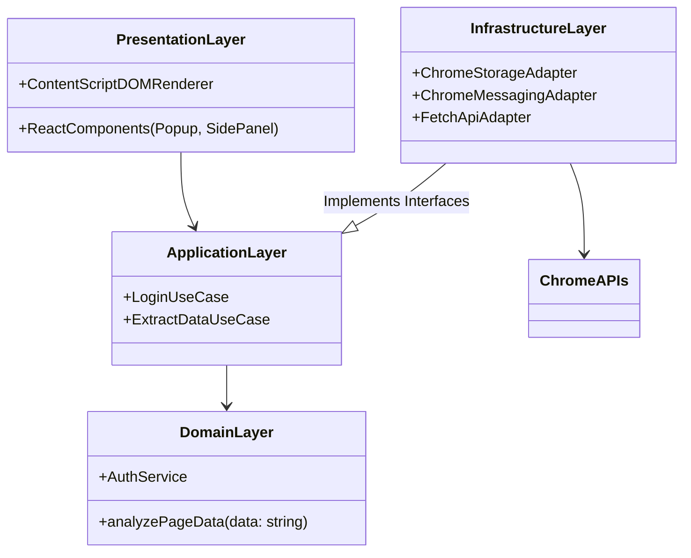

# Profesyonel Eklenti Geliştirici Temel Mühendislik ve Mimari Bilgisi

**Tarih:** 2026-09-30
**Protokol:** `/deepwork`, Clean Architecture
**Bağlam:** Manifest V3 (MV3) ve Modern Web API'leri, Chrome / Chromium Tabanlı Tarayıcılar (2026 Standartları)

---

## 1. Giriş: "Profesyonel Eklenti Geliştiricisi" Kimdir?

Geleneksel web geliştiriciliği (SPA, SSR) ile tarayıcı eklentisi mühendisliği arasında derin bir zihniyet ve paradigma farkı vardır. Web geliştiricisi genellikle tek bir ana işlemde (main thread) çalışan, tarayıcının sekme yaşam döngüsüne hapsolmuş uygulamalar inşa ederken; profesyonel eklenti geliştiricisi **dağıtık, asenkron, olay güdümlü ve çoklu işlem (multi-process) mimarisinde** çalışan bir ekosistem yönetir.

Eklenti mühendisi:
- Farklı güvenlik bağlamları (sandboxes) arasında güvenli iletişim kurmayı bilir.
- Veri sızıntılarını ve CSS çakışmalarını izole etmeyi (Shadow DOM, Isolated Worlds) ustalıkla yönetir.
- Tarayıcı kaynaklarını (RAM, CPU) tüketmeyen, yalnızca olay olduğunda (event-driven) uyanan arka plan servislerini (Service Worker) tasarlar.
- `chrome.*` API'lerinin kısıtlamalarını ve asenkron doğasını Clean Architecture prensipleriyle soyutlayarak sürdürülebilir, test edilebilir sistemler kurar.

---

## 2. Temel Mühendislik Bilgileri ve İleri Seviye Düşünce Modelleri

### 2.1 İleri Seviye TypeScript & Tip Güvenliği (Type-safe RPC)

Tarayıcı eklentilerinde Context'ler (İçerik Betiği, Arka Plan, Açılır Pencere) aynı bellek alanını paylaşmaz. İletişim, serileştirilebilir (JSON) mesajlaşma (Message Passing) üzerinden yapılır. Bu noktada TypeScript ile tip güvenli bir RPC (Remote Procedure Call) mekanizması kurmak, "undefined" veya tip uyuşmazlığı hatalarını derleme zamanında (compile-time) çözmek için kritiktir.

```typescript
// types/messages.ts
export type MessageSchema = {
  'GET_USER_SESSION': {
    request: { forceRefresh?: boolean };
    response: { userId: string; token: string } | null;
  };
  'ANALYZE_PAGE_DOM': {
    request: { selector: string };
    response: { count: number; texts: string[] };
  };
};

// type-safe messenger (Adapter örneği)
export async function sendTypedMessage<K extends keyof MessageSchema>(
  type: K,
  payload: MessageSchema[K]['request']
): Promise<MessageSchema[K]['response']> {
  return new Promise((resolve, reject) => {
    chrome.runtime.sendMessage({ type, payload }, (response) => {
      if (chrome.runtime.lastError) return reject(chrome.runtime.lastError);
      resolve(response);
    });
  });
}
```

### 2.2 Çoklu İşlemci ve Kum Havuzu (Process Sandboxing) Modeli

Eklentiler MV3 ile tamamen ayrık işlemlerde (processes) çalışır:

1.  **Service Worker (Background):** `Utility Process` içerisinde çalışır. DOM'a erişemez. Süreksizdir (ephemeral), boşta kaldığında ölür (terminate).
2.  **Content Script (İçerik Betiği):** Kullanıcının ziyaret ettiği sayfanın `Renderer Process`'i içerisinde, ancak **Isolated World** adı verilen ayrı bir V8 JavaScript bağlamında çalışır. Sayfanın (Main World) JS değişkenlerine müdahale edemez.
3.  **Popup / Side Panel (UI):** Kendine ait bağımsız bir `Renderer Process` ve DOM içerir.

```mermaid
flowchart TD
    subgraph Browser_Process [Browser Main Process]
        Storage[(chrome.storage)]
    end

    subgraph Utility_Process [Utility Process]
        SW[Service Worker\n(Event-Driven, No DOM)]
    end

    subgraph Renderer_Process_Page [Web Page Renderer]
        MW[Main World JS\n(Sayfa Scriptleri)]
        IW[Isolated World\n(Content Script)]
        DOM[Web Sayfası DOM]
        
        MW -- Erişir --> DOM
        IW -- Erişir --> DOM
        MW -.-x|İzole| IW
    end

    subgraph Renderer_Process_UI [Extension UI Renderer]
        Popup[Popup / Side Panel]
    end

    SW <-->|Message Passing| IW
    SW <-->|Message Passing| Popup
    IW -.->|DOM Manipulation| DOM
    
    SW --> Storage
    Popup --> Storage
```

### 2.3 Reaktif ve İzole Durum Yönetimi (Cross-Context State Sync)

Service Worker'ın uykudan uyanıp kapanması, değişkenlerde (`let state = {}`) veri tutulamayacağı anlamına gelir. State, `chrome.storage.local` veya `chrome.storage.session`'da yaşar. Zustand veya Jotai gibi modern kütüphaneler, Chrome Storage adapter'ları ile senkronize edilerek yarış koşulları (race conditions) önlenir. Hızlı tepki gereken ephemeral stateler için `BroadcastChannel` (sekme/worker arası) kullanılır.

```typescript
// Zustand ile Chrome Storage Senkronizasyonu
import { create } from 'zustand';

interface AppState {
  theme: 'light' | 'dark';
  setTheme: (t: 'light' | 'dark') => void;
}

export const useStore = create<AppState>((set) => {
  // İlk yüklemede storage'dan oku
  chrome.storage.local.get(['theme']).then((res) => {
    if (res.theme) set({ theme: res.theme });
  });

  // Storage değişikliklerini dinle (Cross-context sync)
  chrome.storage.onChanged.addListener((changes, areaName) => {
    if (areaName === 'local' && changes.theme) {
      set({ theme: changes.theme.newValue });
    }
  });

  return {
    theme: 'light',
    setTheme: (theme) => {
      chrome.storage.local.set({ theme }); // Storage'a yaz, listener diğer contextleri günceller
      set({ theme });
    }
  };
});
```

### 2.4 Web Components ve Shadow DOM Ustalığı (CSS Bleed Prevention)

Content Script'ler aracılığıyla web sayfasına arayüz eklendiğinde, sayfanın CSS kuralları (örn: `div { color: red !important; }`) eklenti UI'sini bozabilir (CSS Bleed).
Bunu engellemek için **Shadow DOM** (`mode: "open"`) kullanılır. Modern TailwindCSS entegrasyonu için `adoptedStyleSheets` ve Constructable Stylesheets standarttır.

```typescript
// Shadow DOM ve Constructable Stylesheets
const host = document.createElement('div');
host.id = 'my-extension-root';
document.body.appendChild(host);

const shadowRoot = host.attachShadow({ mode: 'open' });

// Tailwind veya kendi CSS'imizi enjekte ediyoruz
const sheet = new CSSStyleSheet();
sheet.replaceSync(`
  .ext-container { background: white; padding: 16px; border-radius: 8px; }
  .ext-text { color: #333; font-family: sans-serif; }
`);
shadowRoot.adoptedStyleSheets = [sheet];

// React veya Vanilla JS ile render
const appContainer = document.createElement('div');
appContainer.className = 'ext-container';
appContainer.innerHTML = '<p class="ext-text">İzole Eklenti Arayüzü</p>';
shadowRoot.appendChild(appContainer);
```

### 2.5 Asenkron Programlama ve Event Loop

Service Worker (MV3) uykuya dalabilen bir yapıdır. Uzun süren asenkron işler Service Worker'ın suspend olmasına neden olabilir. `chrome.alarms` veya WebSocket / Server-Sent Events (SSE) için `chrome.runtime.connect` (Port) ile streaming yönetimi şarttır. Portlar açık kaldığı sürece (belli bir limite kadar) SW'nin kapanmasını engeller.

---

## 3. Clean Architecture Prensiplerinin Eklentilere Uygulanması

Eklentilerde spagetti kodu önlemek için **Domain** mantığı, **Altyapı (Infrastructure/Browser APIs)** katmanından tamamen ayrılmalıdır. `chrome.*` API'lerine doğrudan Domain içinde erişilmez; Adapter (Port/Adapter) modeli kullanılır.

### Mimari Görünüm



### Kod Örneği (Dependency Injection / Inversion of Control)

```typescript
// 1. Port (Arayüz - Domain/Application Layer)
export interface IStorageRepository {
  save(key: string, value: any): Promise<void>;
  get(key: string): Promise<any>;
}

// 2. Adapter (Infrastructure Layer)
export class ChromeStorageAdapter implements IStorageRepository {
  async save(key: string, value: any): Promise<void> {
    await chrome.storage.local.set({ [key]: value });
  }
  async get(key: string): Promise<any> {
    const result = await chrome.storage.local.get(key);
    return result[key];
  }
}

// Test için Mock Adapter
export class InMemoryStorageAdapter implements IStorageRepository {
  private store = new Map<string, any>();
  async save(key: string, value: any) { this.store.set(key, value); }
  async get(key: string) { return this.store.get(key); }
}

// 3. Use Case (Application Layer)
export class SettingsUseCase {
  constructor(private storage: IStorageRepository) {}

  async updateUserSettings(settings: any) {
    // İş kuralları...
    await this.storage.save('USER_SETTINGS', settings);
  }
}

// 4. Bağlama (Composition Root - Service Worker veya Popup Entry Point)
const storageAdapter = new ChromeStorageAdapter();
const settingsUseCase = new SettingsUseCase(storageAdapter);
```

Bu mimari sayesinde eklentinin çekirdek iş mantığı, Chrome tarayıcısı dışında bile (Örn: Node.js test ortamında) `InMemoryStorageAdapter` ile saniyeler içinde %100 test edilebilir.

---
**Sonuç:** Modern, 2026 standartlarında bir eklenti sadece "JavaScript yazmak" değildir; bellek izolasyonu, prosesler arası iletişim (IPC), asenkron yaşam döngüleri ve sağlam bir katmanlı mimari gerektiren ileri düzey bir sistem mühendisliğidir.
