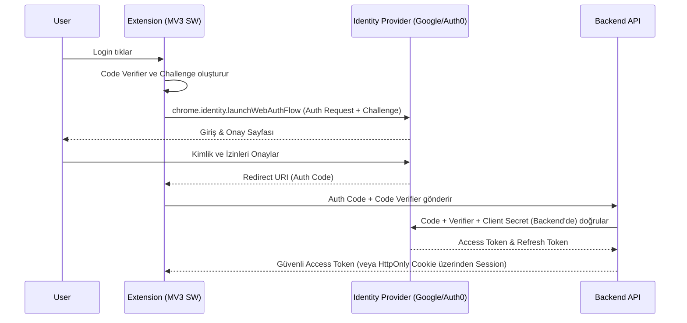

# Profesyonel Güvenlik, Kimlik Doğrulama ve Uyumluluk Rehberi
**Tarih:** 2026-09-30
**Protokol:** /deepwork, Clean Architecture, /product-deepsearch
**Kapsam:** Google Eklentileri (Chrome MV3, Workspace Add-ons, Gemini Extensions) Kurumsal Güvenlik

## 1. Güvenlik ve Uyumluluğun Önemi
Modern kurumsal ortamlarda Google eklentileri (Chrome Extensions, Workspace Add-ons), kullanıcıların hassas verilerine ve iş akışlarına doğrudan erişim sağlar. Güvenlik açıklarının veya uyumluluk ihlallerinin sonuçları yıkıcı olabilir:
- **Mağaza Banlanmaları (Takedowns):** Google Chrome Web Store ve Google Workspace Marketplace, politikaları (Örn. Single Purpose Policy) ihlal eden veya kötü niyetli davranış sergileyen eklentileri anında kaldırır.
- **Veri İhlalleri:** Yetersiz token saklama yöntemleri (XSS üzerinden token çalınması) veya XSS açıkları (DOM Clobbering), kurumsal veri sızıntılarına yol açar.
- **CASA Denetim Başarısızlığı:** OAuth scope'ları kısıtlı verileri (restricted scopes) kapsıyorsa Google CASA (Cloud Application Security Assessment) zorunludur. Başarısızlık durumunda eklentinin API erişimleri kesilir.

## 2. Kimlik Doğrulama ve Yetkilendirme (Enterprise Auth)

### 2.1 OAuth 2.0 with PKCE (Proof Key for Code Exchange)
MV3 Service Worker'larında güvenli kimlik doğrulama için standart, Authorization Code Flow with PKCE'dir. Sabit bir *client secret* tutmak imkansız olduğundan, PKCE ile dinamik şifreleme sağlanır.



### 2.2 Google Identity Services & Workspace OIDC ID Token Doğrulaması
Kullanıcı kimliğini doğrulamak için Google OIDC (OpenID Connect) kullanılır. Eklenti yalnızca `id_token`'ı backend'e iletir ve backend token'ın imzasını (signature) ve *audience* (aud) değerini doğrular.

### 2.3 Güvenli Token Saklama
- **`chrome.storage.session`:** Access Token'ları bellekte tutmak için en güvenilir MV3 yöntemidir. Tarayıcı kapandığında silinir.
- **`chrome.storage.local` ile Şifreleme:** Eğer Refresh Token saklanacaksa, Web Crypto API ile şifrelenerek `chrome.storage.local` içinde tutulmalıdır.
- **Refresh Token Koruması:** Eklenti tarafında Refresh Token tutmak yerine, arka uçta (backend) saklayıp, eklentiye kısa ömürlü (15 dk) JWT token'ları sağlamak daha güvenlidir (BFF - Backend For Frontend paterni).

```typescript
// Token'ı sadece Session Storage'da saklamak (MV3)
async function storeAccessToken(token: string) {
    await chrome.storage.session.set({ accessToken: token });
    // Bu veri diske yazılmaz, content script'ler erişemez (erişim yapılandırmasına bağlı)
    await chrome.storage.session.setAccessLevel({ accessLevel: 'TRUSTED_AND_UNTRUSTED_CONTEXTS' }); 
}
```

## 3. İzin Mimarisi ve Least-Privilege (En Düşük Yetki) Prensibi

### 3.1 `activeTab` vs `host_permissions`
- **`activeTab` İzni:** Kullanıcı bir uzantı eylemini (action click, context menu) tetiklediğinde *geçici* olarak o anki sekmeye erişim sağlar. Sürekli arka plan erişimi gerektirmeyen durumlarda `host_permissions` yerine bu tercih edilmelidir. Mağaza onayı çok daha kolaydır.
- **`host_permissions`:** Tüm sayfalara otomatik müdahale için gereklidir (örneğin `<all_urls>`). Google, çok geniş kapsamlı izinler talep eden uzantıları detaylı bir manuel incelemeye alır ve sağlam bir gerekçe sunulamazsa reddeder.

### 3.2 İsteğe Bağlı Dinamik İzinler (Optional Permissions)
Kullanıcılara eklenti kurulduğunda her izni sormak yerine, özellik kullanıldığında izin istemek (Just-in-Time permissions) en iyi yöntemdir:

```typescript
chrome.permissions.request({
  permissions: ['downloads'],
  origins: ['https://developer.chrome.com/*']
}, (granted) => {
  if (granted) {
    // İzin verildi, işlemi yap
  } else {
    // Kullanıcı reddetti
  }
});
```

## 4. Saldırı Vektörleri ve Savunma Teknikleri

### 4.1 Content Script XSS ve DOM Clobbering
Content Script'ler web sayfası ile aynı DOM'u paylaşır. Eğer sayfa güvenilmeyen veri barındırıyorsa, bu veriyi DOM'a eklemek XSS açıklarına yol açabilir.
- **Savunma:** `DOMPurify` gibi kütüphanelerle HTML sanitize edilmelidir.
- **Trusted Types:** Tarayıcı politikalarıyla tehlikeli DOM API'lerini (ör. `innerHTML`) kısıtlamak.

### 4.2 Mesajlaşma Zafiyetleri (Message Passing)
`window.postMessage` veya harici eklentilerden gelen `chrome.runtime.onMessageExternal` çağrıları, saldırganın zararlı payload göndermesine imkan tanır.
- **Savunma:** Her zaman `sender.origin` veya `sender.id` doğrulanmalıdır.

```typescript
chrome.runtime.onMessageExternal.addListener(
  (request, sender, sendResponse) => {
    const allowedIds = ["trusted-extension-id123"];
    if (!allowedIds.includes(sender.id)) {
      return; // Yetkisiz kaynak
    }
    // Güvenli işlem
  }
);
```

### 4.3 Content Security Policy (CSP) v3
Manifest V3'te uzak sunuculardan barındırılan kod çalıştırmak kesinlikle yasaktır (`script-src 'self'`).
- `eval()` ve `new Function()` kullanılamaz.
- Tüm betikler, eklenti paketinde bulunmalıdır.
- Wasm modülleri `wasm-unsafe-eval` CSP yönergesi ile kullanılabilir.

### 4.4 Ağ Güvenliği: `declarativeNetRequest`
Web request'lerini engellemek/değiştirmek için eski `webRequest` API'si yerine `declarativeNetRequest` (DNR) kullanılır. Bu, gizliliği artırır çünkü eklenti artık doğrudan istek gövdelerini okumadan tarayıcı seviyesinde kurallar uygular.

## 5. Kurumsal Uyumluluk ve Yasal Regülasyonlar

### 5.1 Google CASA (Cloud Application Security Assessment)
Google API'lerinin hassas (restricted) veya kısıtlı (sensitive) kapsamlarını (ör. Gmail okuma, Drive yönetimi) kullanacaksanız bağımsız bir güvenlik denetimi olan CASA'dan geçmek zorundasınız.
- **Tier 2 (Sensitive):** Self-assessment ve güvenlik taramaları.
- **Tier 3 (Restricted):** OWASP ASVS (Application Security Verification Standard) L2 tabanlı, 3. parti akredite güvenlik firması (ör. Bishop Fox, Leviathan) tarafından yapılan derinlemesine penetrasyon testleri.

### 5.2 GDPR, KVKK ve CCPA Uyumu
- **Şeffaflık:** Kullanıcıların verilerinin nerede işlendiği (Privacy Policy) beyan edilmeli.
- **Tek Amaç Politikası (Single Purpose Policy):** Eklenti yalnızca vaat ettiği ana işlevi yapmalıdır.
- **Telemetri ve Onay (Opt-in):** Analitik verileri (Google Analytics vb.) toplamak için kullanıcının açık onayını (Opt-in) almadan hiçbir izleme aracı yüklenmemelidir. Eklenti mağazaları onaysız izleme kodlarını tespit ettiğinde uygulamayı askıya alır.
