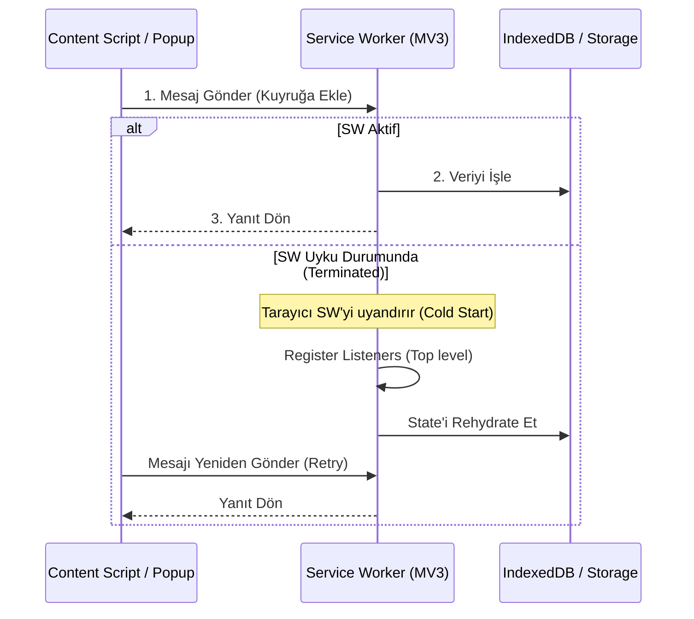

# Google Eklentilerinde Performans Optimizasyonu, Bellek Yönetimi ve Dayanıklılık

**Tarih:** 30 Eylül 2026  
**Protokol:** `/deepwork`, Clean Architecture Standartları  
**Kapsam:** Google Chrome Extensions (MV3), Workspace Add-ons & Gemini/Vertex AI Extensions

---

## 1. Giriş: Kullanıcı Deneyimi ve Tarayıcı Kaynak Tüketim Standartları

Modern tarayıcı mimarilerinde (2025-2026 MV3 standartları), eklentilerin ana sayfanın performansına sıfır etki (zero-impact) yapması beklenir. Kullanıcı deneyimini bozan, ana iş parçacığını (main thread) bloke eden veya arka planda gereksiz bellek/CPU tüketen eklentiler Chrome Web Store tarafından otomatik analizlerle reddedilmekte veya tarayıcı tarafından agresif bir şekilde uyutulmaktadır. Bu nedenle "Sürekli çalışan" (Persistent) yapılar yerine, "Olay güdümlü ve dayanıklı" (Event-driven & Resilient) mimariler inşa etmek zorunludur.

---

## 2. Service Worker Yaşam Döngüsü ve Dayanıklılık (Resilience)

Manifest V3 ile birlikte Service Worker'lar (SW) tamamen *geçici (ephemeral)* hale gelmiştir. Boşta kalma durumunda yaklaşık 30 saniye içinde sonlandırılırlar.

### 2.1. Beklenmedik Kapanmalarla Başa Çıkma
SW'nin durum (state) tutmaması gerekir. Tüm kritik veriler `chrome.storage.local` veya `chrome.storage.session` üzerine yazılmalıdır. Global değişkenler SW kapandığında sıfırlanır. SW her uyandığında, state'i storage'dan yeniden hidrate (rehydrate) edecek şekilde tasarlanmalıdır.

### 2.2. Port Bağlantılarının Kopması ve Auto-reconnect
Uzun süren işlemler (AI asistan akışları, stream işlemleri) için `chrome.runtime.connect` ile açılan portlar, SW'yi açık tutar. Ancak maksimum 5 dakika sonra tarayıcı portları da zorla kapatabilir.

```typescript
// Content Script: Otomatik Yeniden Bağlanma (Auto-reconnect)
let port: chrome.runtime.Port | null = null;

function connectToServiceWorker() {
  port = chrome.runtime.connect({ name: "ai-stream-port" });
  
  port.onMessage.addListener((msg) => {
    console.log("Mesaj alındı:", msg);
  });

  port.onDisconnect.addListener(() => {
    console.warn("Bağlantı koptu, yeniden bağlanılıyor...");
    port = null;
    setTimeout(connectToServiceWorker, 1000); // Backoff stratejisi uygulanabilir
  });
}
```

### 2.3. Mesaj Kuyrukları (Message Queueing)
Content Script'ten SW'ye mesaj gönderildiğinde, SW henüz uyanmamış (cold start) olabilir. Mesajların kaybolmaması için yeniden deneme mekanizmaları (Retry Queues) kurulmalıdır. Mesaj gönderimi bir kuyruk yöneticisi üzerinden yapılmalıdır.

### 2.4. Keep-Alive Desenleri
* **Ne zaman kullanılmalı:** Yalnızca kritik bir WebSocket bağlantısını veya uzun süren, kullanıcının aktif olarak beklediği bir yükleme işlemini ayakta tutmak için `chrome.alarms` veya gizli bir offscreen document ile `setInterval` türevi yapılabilir.
* **Ne zaman kaçınılmalı:** Kullanıcı eklentiyi aktif kullanmıyorken SW'yi zorla uyanık tutmaya çalışmak bir anti-patendir ve eklentinin mağazadan kaldırılmasına yol açabilir.

---

## 3. Bellek Sızıntısı (Memory Leak) Önleme ve Profilleme

Content Script'ler SPA (Single Page Application - React, Vue, Next.js vb.) sitelerinde sayfa yenilenmediği için yaşam döngülerine devam ederler. Bu durum devasa bellek sızıntılarına yol açabilir.

### 3.1. SPA Rota Geçişlerinde Temizlik
DOM'a bağlanan `MutationObserver` veya event listener'lar, o DOM elementi silindiğinde bile referans tutmaya devam ederse "Detached DOM" problemi oluşur. SPA'da route değiştiğinde bu dinleyiciler mutlaka temizlenmelidir (`observer.disconnect()`, `removeEventListener`).

### 3.2. WeakMap ve WeakSet Kullanımı
DOM elementlerine ekstra meta veri veya state bağlarken standart `Map` veya `Object` yerine `WeakMap` kullanılmalıdır. Böylece DOM elementi sayfadan silindiğinde Garbage Collector (GC) referansı anında temizler.

```typescript
// Anti-Pattern: Memory Leak
// const elementCache = new Map();

// Best Practice: GC dostu bellek yönetimi
const elementMetadataCache = new WeakMap<HTMLElement, { isProcessed: boolean }>();

function processElement(el: HTMLElement) {
  if (!elementMetadataCache.has(el)) {
    // İşlem yap
    elementMetadataCache.set(el, { isProcessed: true });
  }
}
```

### 3.3. Profilleme
* **Chrome DevTools Memory:** "Heap Snapshot" alınarak "Detached DOM tree" aranmalıdır. Kırmızı ile işaretlenmiş objeler sızıntıyı gösterir.
* **Allocation Instrumentation on Timeline:** JS nesne üretiminin zamana bağlı grafiğini çıkararak, sürekli artan (testere dişi yerine sürekli yükselen) bellek tahsislerini tespit edebilirsiniz.

---

## 4. Depolama ve Kota Optimizasyonu

### 4.1. chrome.storage.local vs unlimitedStorage
`chrome.storage.local` varsayılan olarak 10MB sınırına sahiptir. Eğer eklenti büyük veriler, cache'lenmiş resimler veya AI embedding'leri tutacaksa manifest'te `"unlimitedStorage"` izni istenmelidir. Ancak JSON serileştirmesi büyük verilerde yavaştır.

### 4.2. chrome.storage.sync Kotası
`chrome.storage.sync` cihazlar arası veri eşitler fakat çok kısıtlıdır: 100KB toplam limit, 8KB öğe sınırı ve dakikada maksimum yazma limiti (Write operations per minute). 
* **Rate Limiting & Debouncing:** Sync API'sine veri yazarken mutlaka debounce uygulanmalıdır.

```typescript
// Sync API için Debounce (Örn: Ayar değişimleri)
import { debounce } from 'lodash';

const saveSettingsSync = debounce((settings) => {
  chrome.storage.sync.set({ userSettings: settings });
}, 2000); // 2 saniyede bir yazmayı garantile
```

### 4.3. IndexedDB ve Dexie.js
Büyük ve sorgulanabilir veriler için (örneğin kullanıcı geçmişi, büyük prompt kütüphaneleri) `chrome.storage.local` yetersiz kalır ve ana thread'i bloke etmese de performansı düşürür. Bu durumlar için **IndexedDB** kullanılmalıdır. `Dexie.js` gibi bir wrapper, IndexedDB kullanımını oldukça basitleştirir.

### 4.4. LRU Cache ve TTL Yönetimi
Performans için bellek içi önbellekleme yapıldığında, sonsuz büyümeyi engellemek adına Least Recently Used (LRU) mantığı ve Time-To-Live (TTL) yönetimi entegre edilmelidir.

---

## 5. Sayfa Açılış Hızına (LCP, FID/INP, CLS) Sıfır Etki Prensibi

Web Vitals (LCP, INP, CLS) metriklerini bozmamak eklenti geliştiriciliğinde kritik kuraldır.

### 5.1. Çalışma Zamanı (run_at)
* `document_start`: Sadece sayfa yüklenmeden önce çalışması GEREKEN (ör: reklam engelleyiciler veya karanlık mod enjeksiyonu) scriptler için kullanılmalıdır.
* `document_idle`: Genellikle önerilen yöntemdir. Tarayıcı ana iş parçacığı boşa çıktığında (LCP tamamlandıktan sonra) çalışır, sayfa açılış hızını etkilemez.

### 5.2. Dinamik Import ve Code Splitting
Content script'ler olabildiğince küçük (hafif) olmalıdır. Ağır kütüphaneler (ör: PDF oluşturucu, karmaşık markdown parser), sadece kullanıcı o özelliği tetiklediğinde dinamik olarak `import()` edilmelidir.

```typescript
// Sadece butona tıklandığında ağır kütüphaneyi yükle
document.getElementById('export-btn').addEventListener('click', async () => {
  const { exportToPDF } = await import('./heavy-pdf-lib.js');
  exportToPDF(document.body);
});
```

---

## 6. Mimari Şemalar

### Service Worker Yaşam Döngüsü ve İletişim


