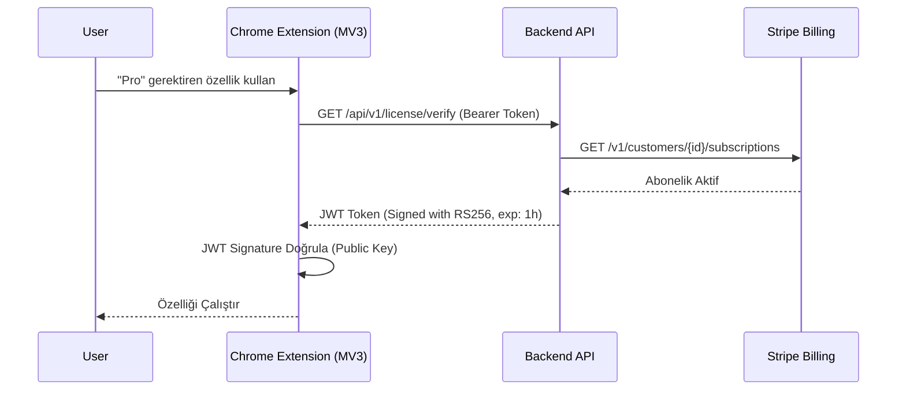

# Araştırma Raporu: Eklentilerde Ürünleşme, Gelir Modelleri ve Mağaza Onay Stratejileri

**Tarih:** Eylül 2026
**Protokol:** `/deepwork`, `/product-deepsearch`
**Hedef Ekosistem:** Google Chrome Extensions (MV3), Google Workspace Add-ons & Apps Script, Gemini / Vertex AI Extensions
**Mimari Standart:** Clean Architecture & 2025/2026 Google Security Guidelines

---

## 1. Eklentiyi Bir Ürüne Dönüştürmek: Yazılım Mühendisliğinden Ürün Mühendisliğine

Bir tarayıcı eklentisini veya Workspace uygulamasını hobi projesinden çıkartıp ölçeklenebilir bir "ürüne" (SaaS) dönüştürmek, mühendislik yaklaşımlarında köklü bir değişim gerektirir. 

*   **Yaşam Döngüsü Yönetimi (Lifecycle Management):** Eklenti yükleme (`onInstalled`), güncelleme, silme (`setUninstallURL`) süreçlerinde veri analitiği (churn tracking) yakalamak.
*   **Hata İzleme (Error Tracking):** Sentry veya Datadog kullanarak istemci hatalarını raporlamak.
*   **Kullanıcı Katılımı (Onboarding):** İlk kurulum sonrası eklenti iconuna tıklanmasını beklemeden, hoşgeldin sayfasının yeni bir sekmede otomatik açılması.
*   **Geri Bildirim (Feedback Loop):** Uygulama içi (in-app) NPS skorları veya hızlı hata bildirim formları.

---

## 2. Gelir Modelleri ve Mimari Entegrasyon (Monetization Architectures)

Chrome Web Store, kendi ödeme sistemini yıllar önce kapattığı için harici ödeme sağlayıcıları de facto standart olmuştur.

### A. Doğrudan Eklenti İçi Ödeme Sistemleri
1.  **Stripe (Checkout & Customer Portal):** En popüler yöntem. "Stripe Checkout" ile ödeme alınır, kullanıcı eklenti arayüzündeki bir butona tıklayarak "Stripe Customer Portal" üzerinden faturalarını/abonelik iptalini yönetir.
2.  **LemonSqueezy & Paddle:** Özellikle Global vergi (MoR - Merchant of Record) süreçlerini (KDV, VAT vb.) otomatik hallettiği için bağımsız geliştiriciler tarafından tercih edilir.
3.  **ExtensionPay:** Eklentiler için özel tasarlanmış, entegrasyonu en basit olan ancak komisyon oranları nispeten yüksek platform.

### B. Lisans Doğrulama: İstemci vs. Sunucu (Anti-Cracking)
Eklenti kodları (HTML/JS) herkes tarafından görüntülenebilir. Bu nedenle doğrulama mimarisi kritik önem taşır:

*   **Zayıf Mimari (İstemci Taraflı):** 
    Kullanıcının ödeme durumu `chrome.storage.local.set({ isPro: true })` şeklinde saklanırsa, basit bir konsol kodu ile eklenti kırılabilir (cracked).
*   **Güçlü Mimari (Sunucu Taraflı JWT Token Doğrulama):**
    1. Kullanıcı giriş yapar (OAuth/Google Auth).
    2. Backend (Supabase/Firebase/Custom Node.js), Stripe'ı sorgulayarak kullanıcının aboneliğini kontrol eder.
    3. Backend, asimetrik şifrelenmiş, kısa ömürlü (Örn: 2 saat) bir **JWT Token** döner.
    4. Service Worker (Background) token'ı doğrular. Token yoksa veya süresi dolmuşsa özellikler kilitlenir (Feature Gating).

#### Asimetrik Lisans Doğrulama Şeması



#### TypeScript ile MV3 Güvenli Lisans Kontrolü

```typescript
// background/licenseChecker.ts
import { verifyJWT } from './utils/jwtVerify';

const PUBLIC_KEY = `-----BEGIN PUBLIC KEY-----\n...\n-----END PUBLIC KEY-----`;

export async function checkProStatus(): Promise<boolean> {
  const data = await chrome.storage.local.get(['proToken']);
  const token = data.proToken;

  if (!token) return false;

  try {
    const decoded = await verifyJWT(token, PUBLIC_KEY);
    // JWT süresi (exp) otomatik doğrulanır
    return decoded.plan === 'pro';
  } catch (error) {
    console.warn('License token invalid or expired.', error);
    // Token geçersizse, arka planda yenileme tetikle
    return false;
  }
}
```

---

## 3. Chrome Web Store İnceleme ve Onay Mühendisliği

Google'ın (ve 2026 algoritmalarının) onay süreçleri yapay zeka destekli statik kod analizi ve insan moderasyonunun birleşimidir. Reddedilmemek için temel ilkeler şunlardır:

### En Yaygın Red Sebepleri ve Çözümleri

1.  **"Single Purpose" (Tek Amaç) İlkesi İhlali**
    *   **Sorun:** Eklenti hem reklam engelleyici, hem PDF dönüştürücü hem de hava durumu aracı olamaz.
    *   **Çözüm:** Eklenti manifestosundaki `description` alanı eklentinin yapabildiği "TEK" temel faydaya odaklanmalı. Yan özellikler bu temel faydayı desteklemelidir.

2.  **Geniş İzinler (Broad Permissions) İhlali**
    *   **Sorun:** Kurulum sırasında gereksiz yere `<all_urls>` veya `"tabs"` izni istemek güven kırıcıdır ve red sebebidir.
    *   **Çözüm:** Mümkün olduğunca `activeTab` izni kullanılmalıdır. `activeTab`, kullanıcı eklenti simgesine tıkladığında sadece "o anki" sekmeye erişim verir, ekstra izin penceresi çıkartmaz. Developer Dashboard'da yazılacak olan **"Permission Justification"** alanları çok net ve spesifik olmalıdır.

3.  **Gizlenmiş / Karartılmış Kod (Obfuscated Code) Yasağı**
    *   **Sorun:** MV3 standartlarında kodlar okunabilir olmalıdır. "Obfuscation" (değişken isimlerini rastgele karakterlere çevirme ve kontrol akışını bozma) KESİNLİKLE yasaktır ve anında hesap askıya alınmasına yol açabilir.
    *   **Çözüm:** Kodlar sadece **minifiye** edilebilir (Minification - boşlukları silme, boyut küçültme). Webpack/Vite kullanırken obfuscation plugin'leri kapatılmalıdır. İnceleme sürecinde Google, kaynak kodu (Source Map) talep edebilir.

4.  **Uzaktan Kod Yükleme (Remote Code) Yasağı**
    *   **Sorun:** Sunucudan JS dosyası indirip çalıştırmak (`eval`, `new Function()`, uzak CDN'den `<script>` tagı çekmek) güvenlik zafiyetidir.
    *   **Çözüm:** Tüm çalıştırılabilir kod parçaları paket içerisinde (bundle) bulunmalıdır. Eğer dinamik bir mantık gerekiyorsa JSON konfigürasyonları çekilip içerideki mevcut kod tarafından yorumlanmalıdır.

---

## 4. Google Workspace Marketplace ve CASA Denetim Stratejisi

Google Workspace (Gmail, Docs, Sheets) için eklenti geliştiriyorsanız kurallar çok daha katıdır.

*   **OAuth Yetkilendirme Ekranı Videoları:**
    Uygulamayı doğrulatırken bir YouTube/Drive videosu çekmeniz şarttır. Videoda; Client ID görünmeli, eklentiye giriş yapılmalı, istenen "Tüm İzinler"in ne amaçla kullanıldığı arayüzde tek tek gösterilmelidir.

*   **CASA (Cloud Application Security Assessment) Denetimleri:**
    *   **Durum:** Hassas kapsamlar (Restricted Scopes, örn: `https://mail.google.com/`) isterseniz Google sizi bağımsız bir güvenlik şirketine (Örn: Leviathan, Bishop Fox) denetime sokar.
    *   **Maliyet ve Süre:** Bu denetimler (Tier 2 veya Tier 3) **15.000$ ile 75.000$** arası maliyet çıkartabilir ve aylar sürer.
    *   **Mühendislik Çözümü (Kaçınma Stratejisi):** Asla tam yetki istemeyin. Sadece e-posta göndermek için `gmail.send` veya sadece kullanıcının oluşturduğu dosyaları görmek için `drive.file` kapsamlarını (scope) kullanın. Doğru izin mühendisliği (Least Privilege) sizi CASA denetiminden tamamen muaf tutabilir.

---

## 5. Kullanıcı Deneyimi (UX/UI) ve Tasarım Standartları

*   **Tasarım Dili:** Google Material 3 (M3) veya markanıza ait net bir Design System kullanılmalıdır.
*   **Arayüz Kısıtlamaları:**
    *   **Popup (Açılır Pencere):** Maksimum **800x600 piksel** olabilir. Daha büyük bir arayüz gerekirse, yeni sekme (New Tab) veya Yan Panel açılmalıdır.
    *   **Side Panel API:** 2024 sonrası yaygınlaşan yan panel (Side Panel) ergonomisi, ekranı terk etmeden uzun süreli işler için (Örn: LLM chat, özetleme) en ideal arayüzdür.
*   **Erişilebilirlik (A11y):** WCAG 2.2 AA standartlarına uyulmalıdır (Kontrast oranları, Aria-label kullanımları).
*   **Hız ve Ergonomi:** `chrome.commands` API'si ile kullanıcıya arayüzü açmak veya belirli fonksiyonları tetiklemek için klavye kısayolları (Örn: `Ctrl+Shift+K`) sunulmalıdır.

---

## 6. Mağaza Gönderimi Reddedilmeme Kontrol Listesi (Pre-Flight Checklist)

- [ ] Tüm manifest izinleri en aza indirgendi mi? (`activeTab` tercihi)
- [ ] Otorizasyon ve Lisans sorguları sunucu tarafında doğrulanıp manipülasyon engellendi mi?
- [ ] Geliştirici Dashboard'da her izin için mantıklı, İngilizce bir açıklama yazıldı mı?
- [ ] Kod paketleyici ayarlarından "Obfuscation" kapatılıp sadece "Minification" açık bırakıldı mı?
- [ ] Harici hiçbir CDN bağlantısından `.js` dosyası çekilmediği (`Content-Security-Policy`) doğrulandı mı?
- [ ] Mağaza grafikleri (Store Assets) tam ölçülerinde (1280x800 Promo, 440x280 Marquee, ikon seti) hazırlandı mı?
- [ ] Eklenti `description` alanı eklentinin sadece TEK bir ana amacına odaklandı mı?

---
*End of Report.*
