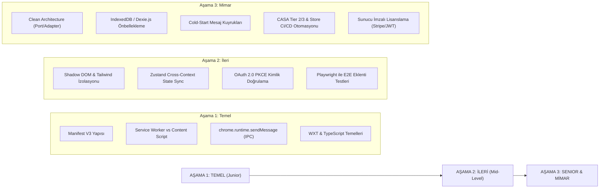

# Profesyonel Google Eklenti Geliştirici Yol Haritası ve Yetkinlik Matrisi (2025/2026 Standartları)

**Tarih:** 30 Eylül 2026  
**Protokol:** `/deepwork` • `/product-deepsearch` • Clean Architecture • Enterprise Engineering  
**Kapsam:** "Google Plugin / Extension Geliştiricisi" Olmak İçin Bilinmesi Gereken Tüm Disiplinler, Mühendislik Standartları ve Yol Haritası  

---

## 1. Giriş: Web Geliştiricisinden "Eklenti Mimarı"na Dönüşüm

Web tarayıcılarında standart bir Single Page Application (SPA) veya web sitesi geliştirmek ile **Google Eklentisi (Chrome Extension veya Workspace Add-on)** geliştirmek arasında köklü bir paradigma farkı vardır.

Web siteleri tek bir DOM ve JS çalışma alanında (`window` context) yaşarken; bir Google eklentisi **aynı anda 4-5 farklı izole bellek alanında (Process Sandboxing)** çalışır, her an işletim sistemi veya tarayıcı tarafından uykudan uyandırılabilir veya öldürülebilir (`stateless ephemeral Service Worker`).

Profesyonel bir eklenti mühendisi; yalnızca UI kodlamayı değil, tarayıcının çekirdek güvenlik sınırlarını (CSP, Isolated Worlds), asenkron IPC haberleşmesini, bellek sızıntılarını ve mağaza moderasyon kurallarını derinlemesine bilmek zorundadır.

```
                                  ┌─────────────────────────────────────────────────────────────┐
                                  │            PROFESYONEL EKLENTİ MÜHENDİSLİĞİ PİRAMİDİ        │
                                  └──────────────────────────────┬──────────────────────────────┘
                                                                 │
                                                  ┌──────────────┴──────────────┐
                                                  │       5. ÜRÜN & TİCARİLEŞME │  • Gelir modelleri (Stripe/JWT)
                                                  │         (Monetization)      │  • Mağaza onay mühendisliği
                                                  ├─────────────────────────────┤  • CASA Tier 2/3 denetimleri
                                                  │       4. TEST & OTOMASYON   │  • Playwright E2E testleri
                                                  │          (CI/CD & QA)       │  • Web Store API otomasyonu
                                                  ├─────────────────────────────┤  • Service Worker Sentry/GA4
                                                  │       3. PERFORMANS & RES.  │  • Cold start mesaj kuyrukları
                                                  │        (Memory & Profiling) │  • WeakMap / SPA DOM temizliği
                                                  ├─────────────────────────────┤  • IndexedDB / Kota yönetimi
                                                  │       2. GÜVENLİK & UYUMLULUK│ • OAuth 2.0 PKCE / OIDC
                                                  │        (Security & Auth)    │ • Katı CSP / Zero Remote Code
                                                  ├─────────────────────────────┤ • XSS / DOMPurify / Least Priv.
                                                  │       1. ÇEKİRDEK MİMARİ    │ • Dağıtık işlemciler (Sandboxing)
                                                  │      (Foundations & IPC)    │ • Type-Safe RPC / Cross-State
                                                  └─────────────────────────────┘ • Shadow DOM & WXT Framework
```

---

## 2. Bilinmesi Gereken 5 Temel Yetkinlik Sütunu

### Sütun 1: Çekirdek Mühendislik ve Çalışma Zamanı Mimarisi (Architecture & IPC)
*İlgili Detay Rapor:* [14_profesyonel_eklenti_gelistirici_temel_muhendislik_ve_mimari_bilgisi.md](file:///Users/alperencnrr/Downloads/Masrafo/docs/codebase/researches/14_profesyonel_eklenti_gelistirici_temel_muhendislik_ve_mimari_bilgisi.md)
1. **İleri Seviye TypeScript:** Eklenti katmanları (Content Script $\leftrightarrow$ Service Worker $\leftrightarrow$ Popup) arasında tip güvenli RPC mesajlaşma şemaları (`type RequestMap = { ... }`).
2. **İşlemci İzolasyonu (Process Sandboxing):** Renderer Process, Extension Background Process, Isolated World ve Main World farklarını yönetebilme.
3. **Reaktif Durum Senkronizasyonu (Cross-Context State Sync):** Bellekleri tamamen ayrı olan katmanlar arasında Zustand/Jotai durumlarını `chrome.storage.onChanged` ve `BroadcastChannel` ile yarış koşulları (race conditions) oluşturmadan atomik eşitleme.
4. **Shadow DOM & Web Components Ustalığı:** Sayfa stillerinin (`CSS bleed`) eklentiyi ezmesini engellemek için React ağacını bir Shadow Root (`mode: 'open'`) içine monte etmek; TailwindCSS'i `adoptedStyleSheets` (Constructable Stylesheets) ile enjekte etmek.
5. **Clean Architecture:** Domain iş mantığını `chrome.*` API'lerinden tamamen soyutlayan Port/Adapter desenleri kurabilme.

---

### Sütun 2: Kurumsal Güvenlik, Kimlik Doğrulama ve Uyumluluk (Security & Auth)
*İlgili Detay Rapor:* [15_profesyonel_guvenlik_kimlik_dogrulama_ve_uyumluluk_rehberi.md](file:///Users/alperencnrr/Downloads/Masrafo/docs/codebase/researches/15_profesyonel_guvenlik_kimlik_dogrulama_ve_uyumluluk_rehberi.md)
1. **OAuth 2.0 PKCE Flow:** Tarayıcı uzantılarında istemci gizli anahtarı (`client_secret`) saklanamayacağı için `chrome.identity.launchWebAuthFlow` ile Proof Key for Code Exchange standardını uygulayabilme.
2. **Güvenli Token Mimarisi:** Hassas access token'ları diskte (`chrome.storage.local`) değil, oturum bazlı in-memory olan `chrome.storage.session` içinde saklama.
3. **Least-Privilege (Minimum Yetki) Prensibi:** `<all_urls>` gibi hantal izinler yerine `activeTab` ve runtime `chrome.permissions.request` kullanarak kullanıcı güvenini kazanma ve mağaza onay sürecini hızlandırma.
4. **Saldırı Vektörleri ve Savunma:** Content script içine giren dinamik DOM verilerini `DOMPurify` ve `Trusted Types` ile sanitize etme; `window.postMessage` dinleyicilerinde `event.origin` ve `sender.id` doğrulaması yapma.
5. **CASA & Regülasyon Uyumu:** Google Cloud Application Security Assessment (OWASP ASVS Level 2) standartlarını ve GDPR/KVKK veri şeffaflığı gereksinimlerini karşılama.

---

### Sütun 3: Performans Optimizasyonu, Bellek ve Dayanıklılık (Performance & Resilience)
*İlgili Detay Rapor:* [16_performans_optimizasyonu_bellek_yonetimi_ve_dayaniklilik.md](file:///Users/alperencnrr/Downloads/Masrafo/docs/codebase/researches/16_performans_optimizasyonu_bellek_yonetimi_ve_dayaniklilik.md)
1. **Service Worker Uyanma Dayanıklılığı (Cold Start Resilience):** Service Worker uykudayken gelen mesajların kaybolmaması için Retry Queue (kuyruk) yapıları kurma; uzun ömürlü Port bağlantıları koptuğunda üstel geri çekilmeli (`exponential backoff`) otomatik yeniden bağlanma döngüleri.
2. **SPA Bellek Sızıntısı (Memory Leak) Yönetimi:** Modern web sitelerinde (Twitter, Gmail, YouTube) sayfa yenilenmeden rota değiştiğinde biriken `MutationObserver` ve event listener'ları `WeakMap` kullanarak Garbage Collector'a teslim etme.
3. **Depolama Kotaları & IndexedDB:** `chrome.storage.sync` (100KB toplam kota, 8KB/öğe limiti, dakikalık yazma sınırı) ile `chrome.storage.local` sınırlarını bilme; 10MB üzerindeki zengin veriler için `Dexie.js` ile IndexedDB önbelleklemesi yapma.
4. **Sayfa Hızına Sıfır Etki:** Eklenti betiklerini `run_at: document_idle` ile çalıştırma; ağır kütüphaneleri dinamik `import()` (Code Splitting) ile talep anında yükleme.

---

### Sütun 4: Test Otomasyonu, CI/CD ve Üretim Gözlemlenebilirliği (DevOps & QA)
*İlgili Detay Rapor:* [17_test_otomasyonu_cicd_ve_uretim_gozlemlenebilirligi.md](file:///Users/alperencnrr/Downloads/Masrafo/docs/codebase/researches/17_test_otomasyonu_cicd_ve_uretim_gozlemlenebilirligi.md)
1. **Eklenti Test Piramidi:**
   - *Birim Test:* Vitest ve `sinon-chrome` / `jest-chrome` ile `chrome.*` API'lerini mocklayarak saf iş mantığını test etme.
   - *E2E Test:* Playwright ile izole Chromium context'i başlatıp `--load-extension` parametresiyle gerçek eklentiyi yükleyerek buton tıklamalarını ve popup etkileşimlerini otomatikleştirme.
2. **Modern Build Pipeline:** WXT veya Vite ile `.env` değişkenlerini ayrıştırma, kod minifikasyonu ve otomatik ZIP arşivi çıkarma.
3. **Otomatik Mağaza Yayınlama:** GitHub Actions üzerinden Chrome Web Store API (`chrome-webstore-upload-cli`) ile her `git tag` atıldığında mağazaya otomatik versiyon yükleme ve incelemeye gönderme.
4. **Üretim Telemetrisi:** Service Worker içerisinde Sentry Web Worker SDK ile çökme loglarını toplama; GA4 Measurement Protocol HTTP API üzerinden gizlilik odaklı kullanım analitiği tutma.

---

### Sütun 5: Ürünleşme, Gelir Modelleri ve Mağaza Onay Mühendisliği (Monetization & Store Review)
*İlgili Detay Rapor:* [18_urunlesme_gelir_modelleri_ve_magaza_onay_stratejileri.md](file:///Users/alperencnrr/Downloads/Masrafo/docs/codebase/researches/18_urunlesme_gelir_modelleri_ve_magaza_onay_stratejileri.md)
1. **Kırılmaya Karşı Güvenli Lisans Doğrulama:** İstemci tarafında `isPro = true` gibi kolayca manipüle edilecek bayraklar yerine, harici backend üzerinden asimetrik RSA/ECDSA ile imzalanmış JWT token doğrulama mimarisi kurma.
2. **Ödeme Sistemleri:** Stripe Billing & Customer Portal, ExtensionPay veya LemonSqueezy entegrasyonu ile freemium özellik kilitleme (Feature Gating).
3. **Chrome Web Store İnceleme Algoritması:** Google moderasyonundan ilk seferde geçmek için:
   - "Tek Amaç (Single Purpose)" ilkesine sadık kalma.
   - İzin Gerekçelerini (Permission Justification) net yazma.
   - Kesinlikle kod karartma (Obfuscation) yapmama, açık ve kaynak haritalı (source-mapped) kod sunma.
4. **Kullanıcı Arayüzü Ergonomisi:** Açılır pencerelerin (Popup) 800x600px sınırını bilme; sürekli görünür deneyimler için Chrome Side Panel API'sini ve Google Material 3 prensiplerini uygulama.

---

## 3. Profesyonel Teknoloji Yığını (Recommended Tech Stack 2026)

| Katman | Önerilen Araç / Kütüphane | Alternatif | Neden Öneriliyor? |
| :--- | :--- | :--- | :--- |
| **Framework** | **WXT (Web Extension Toolkit)** | Vite + @crxjs | Vite tabanlı, auto-manifest, multi-browser derleme, type-safe messaging |
| **Programlama Dili**| **TypeScript 5.x (Strict Mode)** | Saf JavaScript | Çapraz katmanlı asenkron mesajlaşmada sıfır runtime hatası |
| **Arayüz (UI)** | **React 19 / Vue 3 + TailwindCSS** | Svelte 5 | Hızlı prototipleme, zengin bileşen ekosistemi |
| **Stil İzolasyonu** | **Shadow DOM (Constructable CSS)**| CSS Modules | Sayfa CSS'lerinin eklentiyi bozmasını %100 engeller |
| **State Sync** | **Zustand + chrome.storage adapter** | Redux Toolkit | Hafif, boilerplate'siz, storage olaylarıyla anlık çift yönlü senkronizasyon |
| **Veritabanı/Cache** | **Dexie.js (IndexedDB)** | chrome.storage.local | 10MB+ büyük veriler, hızlı indeksleme ve arama |
| **Test** | **Vitest + Playwright** | Jest + Puppeteer | Modern ESM desteği, gerçek Chromium profilinde E2E eklenti otomasyonu |
| **Hata Takibi** | **Sentry (Web Worker SDK)** | Bugsnag | Service Worker ortamında asenkron istisnaları yakalama |
| **Monetization** | **Stripe Customer Portal + Backend JWT**| ExtensionPay | Kurumsal güvenlik, tersine mühendisliğe karşı koruma |
| **CI/CD** | **GitHub Actions + Chrome Web Store API** | Manuel Yükleme | Sıfır insan hatası ile otomatik paketleme ve mağaza teslimi |

---

## 4. Seviyelere Göre Öğrenme Yol Haritası



---

## 5. Üretime Hazırlık Kontrol Listesi (Production Readiness Checklist)

Canlıya çıkmadan ve Chrome Web Store / Workspace Marketplace'e başvurmadan önce şu kontrolleri tamamlayın:

- [ ] **Remote Code Denetimi:** Eklentide uzaktan indirilen hiçbir `.js` veya `eval()` fonksiyonu bulunmuyor.
- [ ] **İzin Budama (Permission Pruning):** `<all_urls>` kaldırıldı; sadece gerekli domainler veya `activeTab` tanımlandı.
- [ ] **Shadow DOM Koruması:** Content script arayüzleri Shadow DOM içinde mi? Sayfanın stilleri bozuluyor mu veya sayfadan etkileniyor mu?
- [ ] **Service Worker Uyanma Testi:** Service Worker uykudayken (`chrome://serviceworker-internals` üzerinden "Stop" diyerek test edildiğinde) gelen ilk tıklama veya mesaj düzgün işleniyor mu?
- [ ] **Bellek Sızıntısı Testi:** SPA sitelerde 20 sayfa gezildikten sonra Chrome Task Manager'da bellek kontrolsüzce artıyor mu?
- [ ] **Lisans Koruması:** Pro özellikler sadece istemci bayrağı ile değil, sunucu imzalı JWT token ile mi doğrulanıyor?
- [ ] **Playwright Testleri:** Tüm kritik kullanıcı akışları CI ortamında yeşil mi?
- [ ] **Store Assets:** 1280x800px promo banner'ları, gizlilik politikası URL'si ve izin gerekçeleri eksiksiz hazırlandı mı?
