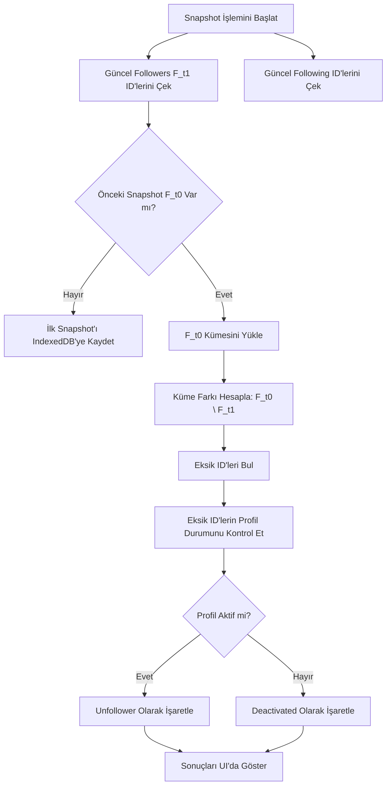

# Research: Sosyal Medya Unfollower Eklentileri Çalışma Mantığı ve Küme Farkı Algoritması

**Tarih:** 30 Eylül 2026  
**Protokol:** /deepwork, Clean Architecture  
**Kapsam:** Sosyal medya takipçi yönetimi algoritmaları, snapshot diffing ve set difference işlemleri.

## 1. Çekirdek Problem: Neden Platformlar Bu Özelliği Sunmuyor?

Instagram, X (Twitter) veya TikTok gibi sosyal medya platformları, kullanıcıların kimin kendilerini takipten çıktığını (unfollow) görmesini sağlayan yerleşik bir buton veya doğrudan bir API (webhook vb.) sunmazlar. Bunun başlıca üç nedeni vardır:

1.  **Kullanıcı Tutundurma (Retention) Psikolojisi:** Sosyal medya platformları, platformda geçirilen süreyi maksimize etmeye çalışır. Takipten çıkıldığını anında öğrenmek, kullanıcılarda olumsuz duygular (misilleme, üzüntü, platformdan soğuma) yaratarak etkileşim metriklerini düşürür.
2.  **Sunucu Yükü (Server Load):** Milyarlarca bağlantının anlık olarak dinlenip her bir "unfollow" olayında karşı tarafa push notification veya webhook tetiklenmesi, devasa bir asenkron işlem yükü (message queue overload) yaratır.
3.  **Gizlilik ve Güvenlik:** Kullanıcı eylemlerinin (özellikle takipten çıkma, engelleme) tamamen ifşa edilmesi, kişisel veri politikaları ve istenmeyen takip (stalking) riskleri açısından platformları yasal yükümlülükler altına sokabilir.

## 2. Temel Çalışma Mantığı: Snapshot ve Küme Farkı Algoritması

Bir sosyal medya hesabının takipçi listesini anlık olarak çekmek bir "Durum Fotoğrafı" (Snapshot) almaktır. Unfollower eklentileri, farklı zamanlarda alınan bu snapshot'ları karşılaştırarak (diffing) değişimleri bulur. 

Bu işlemler **Küme Teorisi (Set Theory)** temellerine dayanır.

### Matematiksel Formülasyon

Zaman $t_0$'daki takipçi kümesi $F(t_0)$ ve zaman $t_1$'deki (şimdiki) takipçi kümesi $F(t_1)$ olsun. Ayrıca şu anki takip edilenler kümesi $\text{Following}(t)$ ve takipçiler kümesi $\text{Followers}(t)$ olsun.

*   **Takipten Çıkanlar (Unfollowers):** Önceki snapshot'ta olup, yenisinde olmayanlar.
    $$U(t_1) = F(t_0) \setminus F(t_1)$$
*   **Yeni Takipçiler (New Followers):** Önceki snapshot'ta olmayıp, yenisinde olanlar.
    $$N(t_1) = F(t_1) \setminus F(t_0)$$
*   **Geri Takip Etmeyenler (Non-Followers):** Senin takip ettiğin ama seni takip etmeyenler.
    $$\text{Non-Followers} = \text{Following}(t) \setminus \text{Followers}(t)$$
*   **Seni Takip Edip Senin Takip Etmediklerin (Fans):** Seni takip eden ama senin takip etmediğin kişiler.
    $$\text{Fans} = \text{Followers}(t) \setminus \text{Following}(t)$$
*   **Karşılıklı Takipleşilenler (Mutuals):** Her iki kümenin kesişimi.
    $$\text{Mutuals} = \text{Following}(t) \cap \text{Followers}(t)$$

## 3. Veri Tabanı Mimarisi ve Snapshot Saklama

Büyük veri setleri (örn. 100k+ takipçi) işlenirken, $O(n^2)$ karmaşıklığa sahip iç içe döngüler tarayıcıyı kilitler. Bu yüzden **O(1) arama karmaşıklığı** sağlayan `Set<string>` (Hash Set) veya Map yapıları kullanılır. 

Graf veritabanı (Neo4j vb.) yerine, istemci tarafında (Tarayıcı Eklentisi) basit ve normalize edilmiş User ID listeleri saklanır. Eklentiler genellikle IndexedDB tabanlı çözümler (Dexie.js vb.) kullanır, çünkü `localStorage` kota sınırlarına (5MB) takılır.

*   **PrimaryKey (PK):** İşlemler `username` yerine her zaman benzersiz, değişmeyen `User ID` üzerinden yapılmalıdır.
*   **Versiyonlama:** Her snapshot, bir timestamp ile `Snapshots` tablosunda saklanır.

## 4. Durum Değişikliği Analizi (Edge Cases)

Kullanıcının listeden eksilmesi her zaman "takipten çıkma" anlamına gelmez. Gelişmiş eklentiler aşağıdaki senaryoları analiz eder:

1.  **Hesap Kapanması (Deactivated) vs Gerçek Unfollow:** Listeden kaybolan kullanıcının profiline anonim/farklı bir session ile istek atılır. Eğer profil hala açık görünüyorsa gerçek "Unfollow", `404 Not Found` dönüyorsa hesap "Deactivated/Deleted" olarak etiketlenir.
2.  **Kullanıcı Adı (Handle) Değişikliği:** Snapshot'lar sadece "username" tabanlı saklanırsa, kullanıcı adını değiştiren biri takipten çıkmış ve yeni biri takip etmiş gibi algılanır. Bu nedenle ID bazlı hash-map eşleşmesi şarttır.
3.  **Engellenme (Blocked):** Eğer listende olmayan bir kullanıcının profili genel erişime açık ama senin oturumunla `404` veya `403` dönüyorsa, engellendiğin anlaşılır.

## 5. Mimari Akış Şeması ve Kod Örnekleri

### Mermaid Akış Şeması: Snapshot Diffing Süreci



### TypeScript ile O(1) Karmaşıklığında Diff Algoritması

```typescript
type UserId = string;

interface SnapshotData {
  timestamp: number;
  followers: Set<UserId>;
  following: Set<UserId>;
}

class FollowerAnalyzer {
  
  /**
   * O(N) zamanda küme farkı (A \ B) hesaplar
   * A'da olup B'de olmayan elemanları döner.
   */
  private setDifference(setA: Set<UserId>, setB: Set<UserId>): Set<UserId> {
    const diff = new Set<UserId>();
    for (const elem of setA) {
      if (!setB.has(elem)) {
        diff.add(elem);
      }
    }
    return diff;
  }

  /**
   * İki snapshot arasındaki takipten çıkanları bulur
   */
  public getUnfollowers(previous: SnapshotData, current: SnapshotData): UserId[] {
    // U(t1) = F(t0) \ F(t1)
    const unfollowerSet = this.setDifference(previous.followers, current.followers);
    return Array.from(unfollowerSet);
  }

  /**
   * Geri takip etmeyenleri (Seni takip etmeyen, senin takip ettiklerin) bulur
   */
  public getNonFollowers(current: SnapshotData): UserId[] {
    // Non-Followers = Following \ Followers
    const nonFollowerSet = this.setDifference(current.following, current.followers);
    return Array.from(nonFollowerSet);
  }
}
```
