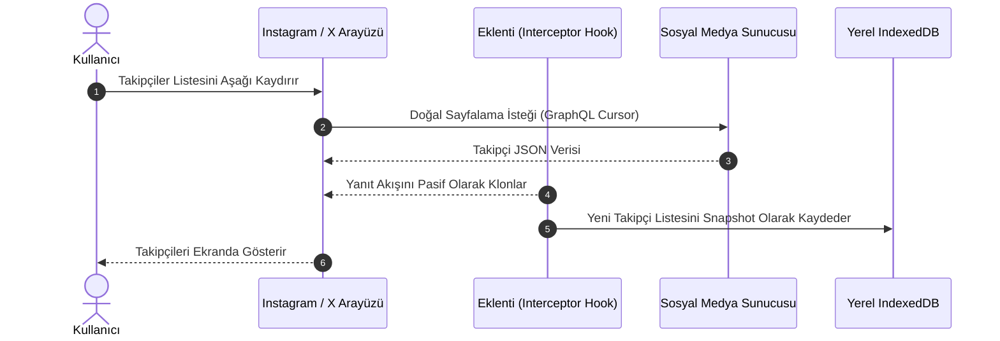

# Sosyal Medya Eklentilerinde Veri Edinme Modelleri ve Ağ Mimarisi

**Tarih:** 30 Eylül 2026  
**Protokol:** `/deepwork` • `/product-deepsearch` • Clean Architecture • Defensive Engineering  
**Kapsam:** Instagram, X (Twitter) ve Web Platformlarında Takipçi Listesi Elde Etme Yöntemleri ve Tarayıcı Mimarisi  

---

## 1. Giriş: Tarayıcı Eklentilerinin Mimari Ayrıcalığı

Standart bir harici sunucu (backend script, bot veya scraper); Instagram veya X gibi platformlardan veri çekmek istediğinde kullanıcı adı/şifre ile giriş yapmak, iki faktörlü doğrulamayı (2FA) aşmak, dinamik captcha'ları çözmek ve platformun WAF (Cloudflare, Akamai) katmanlarını geçmek zorundadır.

Buna karşın **Google Chrome Eklentileri**, doğrudan **kullanıcının kendi yetkilendirilmiş tarayıcısının içinde** çalışır. Kullanıcı zaten `instagram.com` veya `x.com` üzerinde oturum açmış durumdadır; dolayısıyla geçerli oturum çerezleri (`sessionid`, `ct0`, `auth_token`), kimlik doğrulama başlıkları ve yerel depolama anahtarları tarayıcı bağlamında hazırdır.

Bir eklentinin takipçi ve takip edilen verilerini elde edebilmesi için sektörde uygulanan **4 temel mimari veri edinme modeli** bulunmaktadır:

```
                               ┌─────────────────────────────────────────────────────────────┐
                               │           EKLENTİ VERİ EDİNME MODELLERİ MİMARİSİ           │
                               └──────────────────────────────┬──────────────────────────────┘
                                                              │
         ┌─────────────────────────────────────┬──────────────┴──────────────┬─────────────────────────────────────┐
         ▼                                     ▼                             ▼                                     ▼
   [ MODEL 1: PASİF ]                   [ MODEL 2: DOM ]              [ MODEL 3: AKTİF ]                    [ MODEL 4: RESMİ ]
Ağ Dinleme (Interception)            DOM Kazıma (DOM Scraping)     Oturum İçi İstek (Fetch)              Resmi Platform Graph API
(Pasif Ağ Trafiği Yakalama)          (Render Edilen HTML/Liste)    (Content Script Background)           (OAuth 2.0 / Webhooks)
```

---

## 2. 4 Temel Veri Edinme Modelinin Teknik Karşılaştırması

| Kriter | Model 1: Pasif Ağ Dinleme | Model 2: DOM Kazıma | Model 3: Aktif Oturum İsteği | Model 4: Resmi Graph API |
| :--- | :--- | :--- | :--- | :--- |
| **Çalışma Prensibi** | Kullanıcı kendi listesini gezerken geçen JSON paketini kopyalar | Ekrana basılan HTML düğümlerini (li, div) okur | Content script arka planda kendi fetch döngüsünü başlatır | Platformun resmi geliştirici API'sine istek atar |
| **Ek İstek Yükü** | **Sıfır** (Yeni ağ isteği atılmaz) | **Sıfır** (Mevcut DOM okunur) | **Yüksek** (Yüzlerce sayfalama isteği) | API kotaları dahilinde sınırlı |
| **Hesap Banlanma Riski** | **Yok denecek kadar az (En Güvenli)** | **Çok Düşük** | **Yüksek (Rate Limit & Checkpoint)** | **Sıfır (Resmi ve Yasal)** |
| **Kullanıcı Eforu** | Kullanıcının profili açıp kaydırması gerekir | Kullanıcının sayfada aşağı inmesi gerekir | Tek tıkla otomatik başlar | Geliştirici hesabı ve onay gerektirir |
| **Veri Bütünlüğü** | Tam JSON veri nesnesi (ID, isim, avatar) | Kısmi (Sadece DOM'daki görünen alanlar) | Tam JSON veri nesnesi | Sadece izin verilen alanlar |
| **Platform Güncelleme Kırılganlığı** | Düşük (GraphQL şemaları nadiren değişir) | Çok Yüksek (CSS ve div sınıfları değiştikçe çöker)| Orta (Endpoint parametreleri değiştikçe) | Sıfır (Versiyonlanmış kurumsal API) |

---

## 3. Model Detayları ve Çalışma Mekanizmaları

### Model 1: Pasif Ağ Dinleme (Passive Network Interception) — En Güvenli Yaklaşım
Bu modelde eklenti, platformun sunucularına **hiçbir yapay veya ekstra istek göndermez**.

1. Kullanıcı kendi profiline girer ve "Takipçiler" penceresine tıklar.
2. Kullanıcı listeyi aşağı doğru kaydırdıkça (infinite scroll), tarayıcı doğal olarak platformun sunucularına GraphQL veya REST sayfalandırma istekleri gönderir.
3. Eklentinin Content Script'i veya Service Worker'ı bu ağ trafiğini pasif bir şekilde dinler:
   - **Yöntem A (XHR/Fetch Hooking):** Content Script `window.fetch` veya `XMLHttpRequest.prototype.open` fonksiyonlarını "Monkey Patch" yöntemiyle sararak (wrap), gelen yanıtın bir kopyasını klonlar (`response.clone().json()`) ve yerel IndexedDB'ye kaydeder.
   - **Yöntem B (`chrome.devtools.network`):** Geliştirici araçları API'si ile gelen ağ yanıtlarını dinleme.
4. **Avantajı:** Platform güvenlik duvarı (WAF), insan davranışı ile tetiklenen doğal trafiği gördüğü için hiçbir bot veya otomasyon uyarısı (Rate Limit, Checkpoint, 429) vermez.



---

### Model 2: DOM Kazıma (Virtual DOM Scraping)
Platformların API'lerine hiç dokunmadan, doğrudan tarayıcının oluşturduğu DOM ağacındaki elemanları okuma yöntemidir.

1. Kullanıcı takipçiler modalını açtığında, eklenti bir `MutationObserver` başlatır.
2. Listeye yeni bir `div[role="dialog"]` veya `li` eklendikçe, içindeki kullanıcı adı, profil linki ve avatar görseli seçicilerle (`querySelector`) ayıklanır.
3. Eklenti, sanal kaydırma (virtual scroll) yapan listelerde kaybolan elemanları kaçırmamak için anlık olarak `Set<string>` içine ekler.
4. **Dezavantajı:** Instagram ve X, sınıf isimlerini (`class="x1dm5hii x16milqv"`) her derlemede dinamik olarak değiştirdiği için (CSS Mangling / Obfuscation) bu eklentiler her hafta bozulur ve bakım maliyeti çok yüksektir.

---

### Model 3: Aktif Oturum İçi İstek Gönderme (Active In-Session Crawling)
Kullanıcının eklenti ikonuna basıp "Taramayı Başlat" dediği ve eklentinin arka planda döngüyle tüm listeyi çekmeye çalıştığı modeldir.

1. **Bağlam Tespiti:** Eklenti, sayfadaki meta etiketlerinden veya çerezlerden kullanıcının kendi benzersiz kimliğini (`user_id`) okur.
2. **Kimlik Taşıma (Credentials Inclusion):** Eklenti, `fetch(endpoint, { credentials: 'include' })` komutuyla istek attığında, tarayıcı HTTP istek başlıklarına kullanıcının geçerli oturum çerezlerini (`sessionid`, `csrf_token`, `ct0`) otomatik olarak ekler.
3. **Sayfalama Tüketimi (Cursor Loop):** Gelen her sayfadaki `end_cursor` veya `max_id` değeri bir sonraki isteğin parametresi yapılarak liste tükenene kadar istek atılır.
4. **Büyük Tehlike:** Kullanıcının 5.000 takipçisi varsa ve her istekte 50 kişi geliyorsa, eklenti art arda 100 HTTP isteği gönderir. Instagram ve X'in davranışsal analiz sistemleri (Heuristics), insan etkileşimi olmadan 3 saniyede 10 istek atan bu durumu anında algılar; hesaba **429 Too Many Requests**, **Action Block** veya **Güvenlik Doğrulaması (Checkpoint Challenge)** uygular.

---

### Model 4: Resmi Platform Graph API ve Webhook Sınırları
Geliştiricilerin sıklıkla sorduğu soru şudur: *"Neden resmi API kullanmıyoruz?"*

* **Instagram Graph API (Meta for Developers):**
  * Sadece **Instagram İşletme (Business)** veya **İçerik Üretici (Creator)** hesaplarını destekler; kişisel hesaplara API erişimi verilmez.
  * Resmi API'de bir kullanıcının anlık takipçi listesini veren uç noktalar oldukça kısıtlıdır ve **"Biri beni takipten çıkardığında çağrılan bir Webhook" KESİNLİKLE YOKTUR**.
* **X (Twitter) Developer API v2:**
  * Ücretsiz erişim katmanı neredeyse tamamen kapatılmıştır.
  * Kullanıcı takipçi grafiğini (`/2/users/:id/followers`) okumak aylık 100$ ile 5.000$ arasında değişen Pro/Enterprise paketler gerektirir.
* **Gizlilik ve Hukuksal Nedenler:** Meta ve X, kullanıcıların kimleri takip edip kimleri takipten çıkardığı verisinin üçüncü partilerce otomatik izlenmesini topluluk kuralları ve gizlilik politikaları (GDPR) gereğince kasıtlı olarak engellemektedir.

---

## 4. Mimari Özet ve En İyi Uygulama (Best Practice)

Profesyonel ve kullanıcı hesabını riske atmayan bir eklenti mimarisi tasarlarken:

1. **Aktif Agresif Tarama Yapmayın:** Sayfayı döngüsel isteklerle boğan Aktif Tarama (Model 3), kullanıcının hesabının kilitlenmesine sebep olur ve Chrome Web Store'dan hızla şikayet alarak kaldırılır.
2. **Pasif Dinleme (Model 1) veya Yavaş Mod (Jittered Batch) Kullanın:** Kullanıcı profilini gezdikçe veriyi arka planda sessizce biriktiren pasif ağ dinleme mimarisi, hem sıfır risk taşır hem de platform güncellemelerine karşı en dayanıklı yöntemdir.
3. **Tüm Veriyi İstemcide Tutun:** Alınan takipçi listeleri ASLA harici bir sunucuya gönderilmemeli, yalnızca tarayıcının yerel IndexedDB veritabanında matematiksel fark analizine tabi tutulmalıdır.
