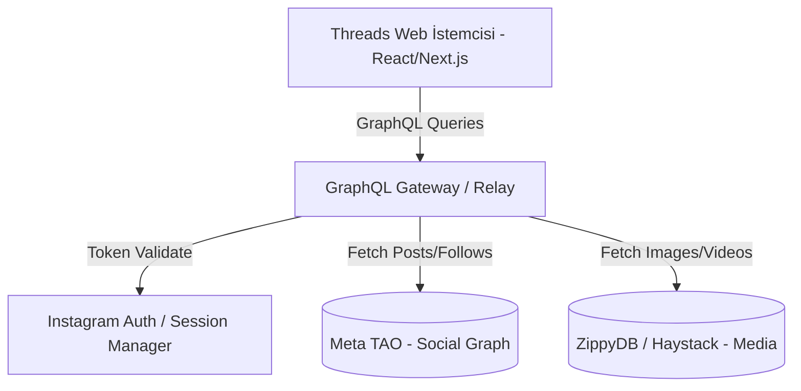
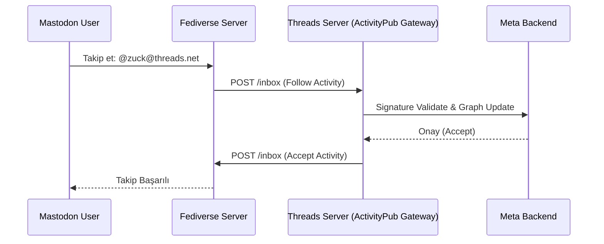

# Threads (threads.net) Platform Mimarisi ve Sosyal Grafik Yapısı
**Tarih:** 2026-09-30
**Protokol:** /deepwork, /product-deepsearch
**Uzmanlık:** Clean Architecture, System Design, Meta Ecosystem

## 1. Threads (threads.net) Nedir? Meta'nın Sosyal Grafik Mimarisi

Meta'nın metin odaklı sosyal ağ platformu olan Threads, sıfırdan inşa edilmiş bağımsız bir sistem olmak yerine, Instagram'ın mevcut, devasa ölçekli backend altyapısı üzerine inşa edilmiş bir "uzantı" uygulamasıdır.

### Instagram Omurgası (Backend Coupling)
Threads'in mimari temelinde Instagram ile **sıkı bağlılık (tight coupling)** bulunur. 
- **Veritabanı ve Kimlik Yönetimi:** Threads hesapları Instagram hesaplarıyla birebir eşleşir. Kullanıcıların Benzersiz Kimliği (Primary Key - PK), Instagram'daki `user_id` ile aynıdır. Meta'nın dağıtık graf veritabanı olan **TAO (The Associations and Objects)** üzerinde Threads gönderileri, Instagram sosyal grafiğinin yeni "edge" ve "node"ları olarak modellenir.
- **Profil Veritabanı Ortaklığı:** Kullanıcı adı (username), profil fotoğrafı, biyografi gibi temel profil verileri tek bir kaynaktan (Instagram profil tablosu) beslenir. Bu nedenle Threads profil güncellemeleri doğrudan Instagram'ı (veya tam tersi) etkiler.

### Web İstemci Mimarisi
- **Frontend Stack:** Modern Threads web istemcisi (threads.net), **Next.js / React** tabanlı bir Single Page Application (SPA) mimarisini benimser. 
- **Veri Katmanı (Data Fetching):** İstemci, verileri Meta'nın standartlarını belirlediği **Relay tabanlı GraphQL** veri modeli ile çeker. Geleneksel REST yerine, karmaşık sosyal grafik (iç içe yorumlar, alıntılar, beğeniler) GraphQL query'leri üzerinden optimize edilerek alınır. Sayfa geçişlerinde sadece değişen GraphQL düğümleri (nodes) güncellenir.

## 2. Resmi Threads API (Meta for Developers) İmkanları ve Sınırları

Meta, Haziran 2024'te başlattığı Threads API'sini geliştirerek yayıncılar ve markalar için dışa açtı ancak API, veri madenciliğini (scraping) ve toplu veri çekimini engellemek üzere "kısıtlı bir kapsamda" tasarlandı.

### Threads API Yetenekleri
- **Gönderi Paylaşımı:** Metin, görsel, video ve atlıkarınca (carousel) formatında içerik yayınlama (Single & Multi-media posts).
- **Yanıt (Reply) Yönetimi:** Gönderilere gelen yanıtları okuma, belirli yanıtlara cevap verme veya gizleme.
- **Temel İçgörüler (Insights):** Gönderi görüntülenmesi (views), beğeniler (likes), yanıtlar (replies) ve yeniden paylaşımlar (reposts) gibi temel analitik metriklerin çekilmesi.

### Sınırlar ve Tasarım Kararları
- **Takipçi Listesi Dökümü Yok:** Resmi API'de bir kullanıcının tüm takipçilerini çekmek için uç nokta (endpoint) bulunmaz.
- **Unfollow Webhook Yok:** "Beni kim takipten çıktı" tarzı analizleri mümkün kılacak anlık unfollow veya unfriended webhook'ları kasıtlı olarak API'ye eklenmemiştir.
- **Neden?** 
  1. **Gizlilik Politikaları (Privacy):** Cambridge Analytica skandalı sonrası Meta'nın 3. parti geliştiricilere veri sağlama politikası son derece sıkılaştırıldı.
  2. **Platform Tutundurma (Retention):** Takipçi grafiğinin platform dışına sızdırılması ve dışarıda alternatif sosyal ağların (rakip platformların) beslenmesi engellenmek istenir. Geliştiriciler, Threads'e içerik basabilir ancak Threads'in ağ değerini (network effect) dışarı çıkaramaz.

## 3. ActivityPub ve Fediverse Boyutu

Threads'in en kritik mimari farkı, açık ağ protokolü **W3C ActivityPub** standardını desteklemesidir. Bu entegrasyon, Threads'i merkezi olmayan Mastodon gibi "Fediverse" (Federated Universe) sunucularıyla bağlar.

- **Çift Yönlü İletişim (Federation):** ActivityPub sayesinde Threads kullanıcıları, (Opt-in ayarı açık ise) Mastodon üzerindeki kullanıcılar tarafından takip edilebilir ve gönderileri oraya aktarılır (`Follow`, `Accept`, `Create`, `Like` aktiviteleri).
- **Takipçi Grafiği Sınırları:** Fediverse entegrasyonu, resmi Threads API'sinin veremediği bazı açık kapılar sunar. Açık bir Threads profili Fediverse üzerinden takip edildiğinde, ActivityPub protokolü gereği bu takip ilişkisi Inbox/Outbox mekanizması ile iletilir. Ancak Threads, kendi içinde kapalı kalan (Fediverse'e yansımayan) milyonlarca salt-Threads kullanıcı takip ilişkisini sızdırmaz. Yani Fediverse uç noktaları üzerinden sadece platform dışı etkileşimler sorgulanabilir.

## 4. Web İstemcisi Başlıkları ve Güvenlik Parametreleri

Threads istemcisi (ve reverse engineering girişimleri), Meta'nın klasik web güvenlik doğrulama setini kullanır. Bir HTTP isteği yapıldığında (örneğin `/api/graphql` uç noktasına) aşağıdaki özel başlıkların ve çerezlerin doğruluğu kontrol edilir:

- `x-ig-app-id`: Uygulama ID'si. Threads web için genellikle sabit bir kimliktir (Örn: `238260118697367`). Meta backend'i gelen isteğin hangi platform client'ından (iOS, Android, Web) geldiğini anlar.
- `x-fb-lsd` (Local Storage Data): CSRF benzeri çalışan, cihaz/tarayıcı kimliğini doğrulayan oturuma bağlı bir "zaman damgalı" (timestamped) güvenlik token'ıdır.
- `sessionid`: Kullanıcının aktif oturum çerezi (Instagram tabanlı). Bu çerez olmadan API uç noktaları `401 Unauthorized` döner.
- `csrftoken` & `x-csrftoken`: Form gönderimlerinde ve State değiştiren API çağrılarında (POST/GraphQL mutations) Cross-Site Request Forgery saldırılarını önlemek için kullanılan zorunlu token'dır.

### Karşılaştırmalı Analiz Özeti
| Özellik | Resmi Threads API | İç Web GraphQL API | ActivityPub Uç Noktası |
| :--- | :--- | :--- | :--- |
| **Kullanım Amacı** | Markalar, Yayıncılar, Botlar | Tarayıcı İstemcisi | Fediverse / Mastodon |
| **Kimlik Doğrulama** | OAuth 2.0 Access Token | Çerez (`sessionid`), `x-ig-app-id` | HTTP Signatures (RSA) |
| **Follower Data** | Sayı var, Liste yok | Gizlilik ayarlarına bağlı | Yalnızca Fediverse hesapları |
| **Veri Modeli** | RESTful / JSON | Relay / GraphQL | JSON-LD / Activity Streams 2.0 |

---
*Bu doküman mimari bir araştırma çıktısıdır, ürün geliştirme süreçlerinde ve 3. parti API entegrasyon kararlarında referans olarak kullanılmalıdır.*
