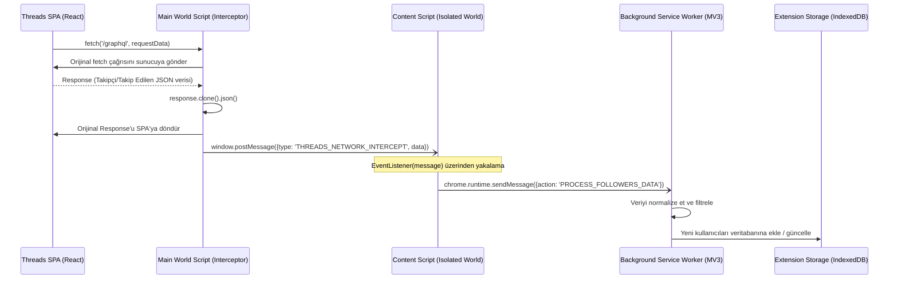

# Threads İçin Unfollower Eklentisi Veri Yakalama ve Dinleme Mimarisi
**Tarih:** 2026-09-30
**Protokol:** /deepwork, /product-deepsearch
**Bağlam:** Clean Architecture, Chrome Extensions Manifest V3 (MV3), React/Relay SPA Veri Çekimi

## 1. Veri Yakalama Stratejileri: Neden Threads'te Pasif Ağ Dinleme (Passive Interception) Tercih Edilmelidir?
Threads, React ve Relay gibi modern web teknolojileri ile geliştirilmiş, sanal DOM (Virtual DOM) kullanan oldukça dinamik bir Tek Sayfa Uygulamasıdır (SPA - Single Page Application).
Böyle bir mimaride klasik DOM kazıma (DOM scraping) yöntemleri yetersiz ve kırılgan kalır:
- **Obfuscated CSS/DOM:** Sınıf adları ve DOM yapısı her güncellemede veya derlemede değişir.
- **Sanal Listeler (Virtualized Lists):** Sadece ekranda görünen DOM elemanları render edilir (örneğin takipçi modalında aşağı kaydırdıkça üstteki elemanlar DOM'dan silinir).
- **Performans:** Sürekli değişen DOM'u `MutationObserver` ile izlemek, tarayıcıda darboğaz yaratabilir.

Bu nedenlerle **Pasif Ağ Dinleme (Passive Network Interception)** en sağlam ve etkili stratejidir. Eklenti, Threads istemcisi ile sunucu arasındaki GraphQL / REST API trafiklerini (fetch veya XHR) sayfa bağlamında gizlice dinler, gelen yapılandırılmış JSON verilerini (örneğin; takipçi listesi, pagination token'ları) herhangi bir DOM değişikliği kısıtlamasına takılmadan anında ve eksiksiz olarak yakalar.

## 2. Manifest V3'te Çift Dünyalı (Two-World) İletişim Mimarisi
Chrome eklentileri güvenlik ve izolasyon sağlamak amacıyla betikleri farklı bağlamlarda (contexts) çalıştırır.

### "Main World" (Sayfa Bağlamı) vs "Isolated World" (Content Script Bağlamı)
- **Isolated World:** Varsayılan olarak Content Script'lerin çalıştığı izole ortamdır. Sayfanın DOM'una erişebilir ancak sayfanın JavaScript değişkenlerine (örneğin `window.fetch`, `window.React`) erişemez.
- **Main World:** Sayfanın asıl JavaScript bağlamıdır. Ağ kancalama (network hooking) yapabilmek için `window.fetch` metodunun orijinalini değiştirmemiz gerekir, bu da yalnızca Main World'de mümkündür.

### Manifest V3 `world: 'MAIN'` Enjeksiyonu
Manifest V3'ün modern sürümleriyle birlikte, Main World'e betik enjekte etmek yerleşik olarak desteklenmektedir. İki yöntemle yapılabilir:
1. **Statik (`manifest.json`):**
```json
"content_scripts": [
  {
    "matches": ["*://*.threads.net/*"],
    "js": ["main-world-interceptor.js"],
    "world": "MAIN",
    "run_at": "document_start"
  },
  {
    "matches": ["*://*.threads.net/*"],
    "js": ["isolated-content-script.js"],
    "world": "ISOLATED",
    "run_at": "document_start"
  }
]
```
2. **Dinamik (`chrome.scripting.registerContentScripts`):** Arka plan (Service Worker) servisinden dinamik olarak Main World betiği kaydedilebilir.

## 3. Pasif Ağ Kancalama (Fetch Interception)
Aşağıdaki adımlarla Threads GraphQL ağ çağrıları kancalanır ve veriler eklentiye aktarılır.

### A. Main World Kancalama ve JSON Klonlama (Monkey Patching)
Sayfa yüklenirken (DOM henüz parse edilmeden önce) `window.fetch` metodunu değiştiririz.

```typescript
// main-world-interceptor.ts
(function() {
  const originalFetch = window.fetch;
  
  window.fetch = async function(...args) {
    const response = await originalFetch.apply(this, args);
    const url = typeof args[0] === 'string' ? args[0] : (args[0] as Request).url;
    
    // Yalnızca ilgili GraphQL veya veri API'lerini hedefle
    if (url.includes('/graphql') || url.includes('/api/')) {
      try {
        // Akışı bozmamak için yanıtı klonluyoruz
        const clone = response.clone();
        clone.json().then(data => {
          // Gelen JSON verisinde takipçi/takip edilen modelini tespit et
          if (isFollowersResponse(data)) {
            // Veriyi Isolated World'e (Content Script) güvenli şekilde gönder
            window.postMessage({
              type: 'THREADS_NETWORK_INTERCEPT',
              payload: data
            }, '*');
          }
        }).catch(err => console.error("Interceptor JSON parse error:", err));
      } catch (e) {
        // Sessizce hatayı yut, sayfanın çalışması durmasın
      }
    }
    return response;
  };
})();
```

### B. Isolated World ve Service Worker Köprüsü (Bridging)
Main World'den fırlatılan mesajları Content Script yakalar ve eklentinin arka plan servisine (`chrome.runtime.sendMessage`) iletir.

```typescript
// isolated-content-script.ts
window.addEventListener('message', (event) => {
  // Sadece aynı sayfadan gelen mesajları kabul et
  if (event.source !== window || !event.data) return;
  
  if (event.data.type === 'THREADS_NETWORK_INTERCEPT') {
    // Mesajı Service Worker'a aktar
    chrome.runtime.sendMessage({
      action: 'PROCESS_FOLLOWERS_DATA',
      data: event.data.payload
    });
  }
});
```

## 4. Alternatif: Sanal DOM Kazıma (Virtual DOM Tracking)
Eğer ağ kancalama (API değişiklikleri nedeniyle) kullanılamaz hale gelirse yedek plan olarak Sanal DOM kazıma kullanılabilir.
- **Yöntem:** Threads profilinde "Takipçiler" veya "Takip Edilenler" modalı açıldığında, liste container'ına bir `MutationObserver` bağlanır.
- **Zorluk - Sanal Liste:** Modal içinde aşağı kaydırıldıkça (scroll) yeni `<div class="x1i10hfl...">` elemanları DOM'a eklenirken, üstte kalanlar DOM'dan silinir (memory management için).
- **Çözüm:** `MutationObserver` ile eklenen *her yeni* kullanıcı satırının DOM'daki benzersiz kimliğini (href linki veya kullanıcı adı metni) okuyarak global bir bellekte (örneğin bir Set veya IndexedDB) biriktirmek gerekir.

## 5. Mimari Akış Diyagramı


